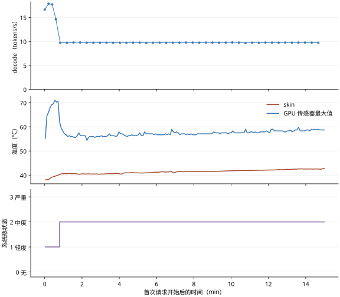

# 附录 D · 基准数据集

> 本附录保留历史测量的运行时版本、设备与条件；书稿源码基线升级到 v0.17.0 不改变这些测量身份。v0.17.0 的 Mac 性能重测单列于第十六节，旧表不改标为新版结果。


> 书中所有标注“〔基准 D〕”的实测数据都来自本附录定义的数据集。采集条件、原始记录与结果分开列出，避免把实测与理论估算混为一谈。

## 采集状态

> **Android 重测状态：尚未用 v0.17.0 重跑。** 第十三至十五节保留 v0.13.1 的手机实测数据，不代表当前源码版本的性能。v0.17.0 本轮仅完成 Mac 性能重测。

> 主矩阵采集于 2026-07-05，原有扩展实验采集至 2026-07-18；2026-09-05 新增的 HONOR 同机与图片案例单列于第十四、十五节。Mac 主基准记录共 30 次：18 次 backend × context 主矩阵，以及 12 次 `false`/`auto` 再采样；Android、自然文本 MTP、线程数和约束解码结果另列，不与主矩阵混算。原始记录位于 `experiments/data/`。

## 一、采集环境（固定，不可混）

| 项 | 值 |
|---|---|
| 芯片 / 内存 | Apple M5 Pro / 24 GiB |
| 系统 | macOS 26.5 |
| 主基准模型 | Gemma 4 E4B（`litert-community/gemma-4-E4B-it-litert-lm`，公开、支持 MTP，3.66 GB ≈ 3.4 GiB；SHA-256 `0b2a8980ce155fd97673d8e820b4d29d9c7d99b8fa6806f425d969b145bd52e0`） |
| 后端 | cpu、gpu（Metal） |

主模型支持 MTP，因此第 9 章的投机解码实测与主基准使用同一个模型。

## 二、方法

- 矩阵：backend ∈ {cpu, gpu} × prefill/上下文 ∈ {256, 1024, 4096}，decode 固定 128 token。
- 重复：每个条件跑 3 次，取中位数（抵消抖动）。
- 指标：prefill tokens/s、decode tokens/s、Init API 聚合值（s）、TTFT（s）。（`litert-lm benchmark` 不报峰值内存，故本表不含该列。）C API 会把 `GetInitPhases()` 中可能重叠的阶段 duration 相加，因此 Init 列不是无重叠的端到端墙钟时间。
- 证据范围：本书的性能数字只引用本数据集与注明出处的官方数据。更换后端、模型或机器后，结果作为另一组数据单独标注，不参与混合计算（第 8 章）。
- 原始 CSV 存 `experiments/data/baseline.csv` 与 `mtp.csv`，元信息存 `experiments/data/_meta.txt`。
- 缓存：CLI 使用 `--cache disk`，编译产物持久化在模型旁的缓存文件（取值含义见附录 C 第一节）。同一批次里，gpu/256 的第 1 次 Init API 聚合值为 5.29 s，该条件后两次为 1.76、1.75 s；gpu/4096 的第 1 次为 4.77 s。表中 Init 列是各条件 3 次的中位数，不含这些单次冷启动值。

## 三、结果

主基准使用 Gemma 4 E4B，decode 长度为 128 token；表中数据为各条件的中位数：

| backend | 上下文 | prefill tokens/s | decode tokens/s | Init API 聚合值（s） | TTFT（s） |
|---|---|---|---|---|---|
| cpu | 256 | 65.6 | 24.8 | 0.54 | 3.94 |
| cpu | 1024 | 259.2 | 24.7 | 0.54 | 3.99 |
| cpu | 4096 | 226.5 | 20.7 | 0.57 | 18.13 |
| gpu | 256 | 259.8 | 50.6 | 1.76 | 1.01 |
| gpu | 1024 | 999.1 | 50.6 | 1.77 | 1.04 |
| gpu | 4096 | 925.2 | 45.6 | 1.78 | 4.45 |

投机解码使用同一模型，context 为 1024；表中数据为 decode 吞吐中位数：

| MTP | cpu | gpu | 说明 |
|---|---|---|---|
| 关（false） | 22.8 | 50.0 | 基线 |
| auto | 24.9 | 50.2 | `auto` 沿用默认的关闭行为（第 9 章），此行与基线是同行为的再采样 |

> 注：MTP 表与主表来自两个独立采集批次，故 cpu“关”的 22.8 与主表同条件的 24.7 不必相等。该批三次运行为 20.1 / 22.8 / 24.9（极差 4.8）；gpu“关”批首跑 44.1，后两次为 50.0 / 50.1。`false` 与 `auto` 在 v0.13.1 中都是关闭行为，表中差异只反映再采样波动。这批 Mac 主基准没有强制开启组。第十三节另列 Android 开关对照与自然代码补测，后者包含 Mac 的单次摘要记录，但缺少完整 prompt 和原始计时日志。

## 四、结果使用边界

各表只支持所列设备、模型、后端、输入和采集方法下的观察。端到端吞吐不能单独分离计算、访存、同步与调度成本；相应机制与结果解读见正文各章。

## 五、实验索引

各章实验的完成状态、复现入口与未形成结果的项目见附录 C，本附录不重复列出。

## 六、模型文件分析（gemma-4-e4b model.litertlm）

本次分析不依赖 `litertlm_print`：先按 16 KiB 对齐边界查找 TFLite 魔数 `TFL3`，再用 TFLite schema 的 FlatBuffers 绑定读取每段的 signature 与张量形状。文件 3.66 GB，共 10 个 TFLite 段；完整记录见 `experiments/data/model_anatomy.md`：

| 段起点（字节） | 大小 | 签名 | 关键张量 |
|---:|---:|---|---|
| 4,734,976 | 171 MB | `embedder` | `token_ids[1,1]` |
| 175,669,248 | 837 MB | `per_layer_embedder` | `token_ids[1,1]` |
| 1,012,449,280 | 94 MB | `serving_default`（音频编码器） | `mask[1,1,816]` |
| 1,106,509,824 | 16 MB | `audio_adapter` | `features[1,204,1536]` |
| 1,122,254,848 | 16 KB | `eoa` | 不适用 |
| 1,122,271,232 | 224 MB | `vision_70/140/280` | `images[1,1260,768]` |
| 1,346,420,736 | 8 MB | `vision_adapter_70/140/280` | `soft_tokens[1,140,768]` |
| 1,354,317,824 | 16 KB | `eoi` | 不适用 |
| 1,354,334,208 | 2,260 MB | `decode` / `prefill_1024` / `prefill_128` / `verify` | `embeddings[1,1,2560]` |
| 3,614,392,320 | 45 MB | `mtp_drafter` | `activations[1,1,5120]` |

主干模型 `decode` signature 的关键事实：

- KV cache 输入 48 个张量 = 24 层 × (K+V)，dtype 全部为 INT8；20 层 `[1,2,32003,256]`、4 层 `[1,2,32003,512]`（V 侧维度转置存放）。
- KV 每 token = 2 × 2 × (20×256 + 4×512) × 1 B = 28,672 B = 28 KiB；4096 上下文 = 112 MiB；文件中的宽度 32003 是 magic number 占位值（见 6.2.2 节），实际静态宽度由 `--max-num-tokens` 决定，默认上限 32000 对应 875 MiB。
- `embeddings[1,1,2560]` → model_dimension = 2560；`per_layer_embeddings[1,1,42,256]`；logits `[1,1,262144]` → 词表 262,144 = 2^18；`param_tensor[1,1,1,7]`（单缓冲 KV 路径的位置参数，见第 6 章）。
- prefill 入口集为 {1024, 128}（第 4 章分块示例所用的实际入口）；`verify` 与 `mtp_drafter` 段互相配套（第 9 章）；vision 三档签名与三档 adapter 配套（第 11 章）。
- 元数据中的聊天模板以 `<turn|>` 作为轮次结束标记。模型文件中不存在 `end_of_turn` 字样；这是第 5 章讨论停止符的依据。

## 七、prefill 长度扫描（cpu，-d 32，disk 缓存热，单次）

| prefill tokens | prefill tokens/s | decode tokens/s | TTFT (s) |
|---:|---:|---:|---:|
| 100 | 48.3 | 12.8 | 2.15 |
| 250 | 64.0 | 25.7 | 3.95 |
| 500 | 128.4 | 26.3 | 3.93 |
| 1000 | 257.0 | 25.9 | 3.93 |
| 2000 | 260.9 | 26.1 | 7.71 |
| 3000 | 261.3 | 26.0 | 11.52 |
| 4000 | 229.3 | 20.7 | 17.49 |

基准模型只有 `prefill_128` 与 `prefill_1024` 两个静态入口。250、500、1000 token 都使用 1024-token signature，对应墙钟时间约为 3.91、3.90、3.89 s；吞吐差异主要反映有效 token 占比，不能单独证明算术强度变化。2000 token 以上需要多个分块，现有数据不能分离注意力与调度成本。本表 decode 只运行 32 步，主结果仍以第二节的 128 步矩阵为准。原始数据见 `experiments/data/prefill_sweep.csv`。

## 八、采样确定性实验（cpu）

同一提示词（"Write one sentence about the ocean."）在温度 0、相同种子下运行两次，输出逐字一致。温度 1.0 时，seed 7 与 seed 1 生成了不同句子，seed 1 与 seed 2 则生成了相同序列；启用随机采样不保证每次输出都不同。复现时须固定运行时版本、模型文件、后端、提示词、温度、top-k、top-p 与缓存模式；2026-08-31 以重装的新版运行时复测同一命令，温度 0 得到另一句，确定性不跨环境成立。实录见 `experiments/data/temperature_test.md`。

## 九、`--max-num-tokens` 预留宽度扫描（cpu，2026-07-17 补采）

观察第 6 章所述固定形状路径中预留宽度与 decode 吞吐的关系。脚本 `experiments/max_tokens_sweep.sh`，原始数据 `experiments/data/max_tokens_sweep.csv`（`-d 128`，磁盘缓存热，各 2 次）。实验同时改变了所选 signature 或张量宽度所带来的多项执行成本，未用性能计数器把 KV 访存单独分离出来。

| max_num_tokens | prompt | decode tokens/s | 备注 |
|---:|---:|---:|---|
| 1024 | 100 | 33.9 | 分块 [128] |
| 2048 | 256 | 23.5 / 29.5 | 两次散布大，取区间 |
| 4096 | 256 | 26.4 | 与默认值推导一致（(256+1023)/4096+1）×4096 |
| 8192 | 256 | 21.5 | 同一 prompt，仅放宽预留 |
| 1024 | 256 | 运行失败 | 分块 [1024] 恰好占满预留宽度，prefill 报 `dynamic_update_slice` 维度越界 |

同为 256-token prompt 时，4096 档约 26.4 tokens/s，8192 档约 21.5 tokens/s，后者低约 19%。1024/100 的 33.9 tokens/s 使用不同 prompt 与不同 signature，只能作为不同条件下的复现记录，不能与 8192/256 计算速度比例。1024/256 直接失败，说明预留宽度过小可能触发维度越界。2048 档两次结果散布较大，不据此下点值结论。

## 十、MTP 聚合接受比例实测

Python SDK 将日志级别设为 VERBOSE 后，drafter 析构时会打印 drafted 与 verified token 计数。完整记录见 `experiments/data/mtp_acceptance.md`。

| 输入 | drafted | verified | 聚合比例 \\(r=verified/drafted\\) | \\(G=3\\) 时每轮期望产出 \\(1+3r\\) |
|---|---:|---:|---:|---:|
| 机器人学习绘画的 100 词故事 | 213 | 56 | 0.2629 | 1.79 token |
| Fibonacci 函数及解释 | 3069 | 3054 | 0.9951 | 3.99 token |

这里的 \\(r\\) 是每轮接受前缀长度的聚合比例，不是“各位置具有相同独立命中概率”的 \\(p\\)。端到端加速还取决于 drafter、verify 和固定调度开销，不能只由 \\(r\\) 推出。两个提示词记录到的比例不同，但样本不足以建立一般性的内容规律。benchmark 的 pad 合成输入没有记录 \\(r\\)，因此本表不作为主基准开关结果的直接归因。

## 十一、约束解码开/关工具调用观察

Python SDK 在 Gemma 4 E4B、GPU 后端上比较 `enable_constrained_decoding=True/False`。原始记录见 `experiments/data/constraint_test.md`。

| 场景 | 温度 | 开启约束 | 关闭约束 |
|---|---:|---:|---:|
| `get_weather(city)` | 0 | 2/2 结构合法 | 2/2 结构合法 |
| `get_forecast(city, days, unit)` | 0 | 2/2 结构合法 | 2/2 结构合法 |
| `get_forecast(city, days, unit)` | 1.0 | 2/2 结构合法 | 2/2 结构合法 |

共 12 次生成，开启与关闭各 6 次；所测样本均未出现结构错误。该样本量不足以估计失败率，也未覆盖多工具混淆、嵌套 JSON、参数语义和函数执行结果。结论仅限于“在这些样本中未观察到差异”。

## 十二、未形成指标的扩展记录

- 2026 年 7 月 Android 扩展基准的峰值内存无可报告数据；9 月新增的进程内存测量见第十四节。7 月原始 CSV 位于 `experiments/data/android_*.csv`，采集脚本为 `experiments/android_bench.sh`。
- NPU 端到端推理：无可报告数据；加载与失败阶段记录于 `experiments/data/npu_enablement.md`。

## 十三、扩展基准（Android 真机，2026-07-18 采集）

> **待重跑（v0.17.0）**：本节为 v0.13.1 的历史实测记录。

> 本节数据与主基准（Mac M5 Pro）分开标注，不参与混合计算。设备：P0210（qcom，Android 16）；二进制：自编译 `litert_lm_advanced_main`（arm64，v0.13.1）；模型同主基准。真机 CLI 的 `max_num_tokens` 默认取 prompt 与 decode 长度之和，本次显式对齐为 256/1024 → 4096、4096 → 8192。decode 长度为 128 token，各条件运行 3 次取中位数。脚本为 `experiments/android_bench.sh`，原始数据位于 `experiments/data/android_*.csv`。

### Android 主基准

表中数据为真机各条件的吞吐中位数：

| backend | 上下文 | prefill tokens/s | decode tokens/s | TTFT (s) |
|---|---|---|---|---|
| cpu | 256 | 19.9 | 9.9 | 13.0 |
| cpu | 1024 | 79.1 | 10.0 | 13.0 |
| cpu | 4096 | 62.6 | 7.0 | 65.6 |
| gpu | 256 | 258.3 | 18.8 | 1.04 |
| gpu | 1024 | 957.2 | 18.8 | 1.12 |
| gpu | 4096 | 858.6 | 17.4 | 4.83 |

### MTP 开关

以下结果来自真机，context 为 1024，指标为 decode tokens/s：

| MTP | cpu | gpu |
|---|---|---|
| 关 | 10.0 | 18.0 |
| 强制开 | 2.8（降至关闭模式的约 28%） | 12.6（比关闭模式低约 30%） |

benchmark 的负载是“prompt + pad 填充”（`ids.resize`，`runtime/core/session_utils.cc:68-73`），不是自然文本。在该负载下，强制开启 MTP 的端到端吞吐低于关闭模式；本次运行没有记录聚合接受比例，不能把负收益只归因于接受比例。换用自然代码文本（`benchmark_prefill_tokens=0`）后，同一台手机的单次观测高于关闭模式：

| 负载 | cpu | gpu |
|---|---|---|
| 自然代码文本，关 | 11.6 | 16.0 |
| 自然代码文本，强制开 | 12.6（约 +9%） | 32.0（约 2.0 倍） |

实录见 `experiments/data/mtp_natural_phone.md`。这组自然文本结果每个条件只运行 1 次，prompt、decode 长度和采集入口也不完全相同。它只能说明观测结果随负载与后端变化，不能估计稳定加速比。

### 自然代码文本补测

本次补测采集于 2026-07-18，摘要记录见 `experiments/data/mtp_ceiling.md`。verify signature 的 `input_pos` 形状为 [4]，因此 G=3。温度 0、长代码生成时，Mac GPU 从 58.7 增至 133.9 tokens/s（2.28 倍），手机 GPU 从 18.6 增至 37.4 tokens/s（2.01 倍）。若额外假设每轮都产出最大值 4，可由端到端结果反推出有效成本参数约 0.25 和 0.33。这两组每个条件只记录了 1 次，未保存完整 prompt、调用参数与原始计时日志，Mac 组还缺少输出 token 数。现存摘要只能复算列出的吞吐比，不能重算原始时延或估计运行间波动。反推参数不是 drafter 单步成本的独立测量，也不能证明设备已经达到理论上限。

### CPU 线程数扫描

以下结果来自真机，context 为 1024，指标为 tokens/s：

| 线程数 | prefill | decode |
|---:|---:|---:|
| 1 | 22.8 | 4.4 |
| 2 | 45.3 | 7.4 |
| 4 | 77.9 | 10.1 |
| 8 | 131.6 | 13.4 |

## 十四、同一手机上的内存、持续吞吐与文本回调（2026-09-05）

> **待重跑（v0.17.0）**：本节为 v0.13.1 的历史实测记录。

这组测量在同一个部署条件下同时观察模型文件、进程内存和等待时间：设备为 HONOR MEP-AN00，使用 Gemma 4 E4B 的 GPU OpenCL 路径。前文 2026-07 的 Android 记录来自另一台手机，不能与本组混算；新原始记录独立保存在 `experiments/data/2026-09-05/`，复现命令见附录 C 第四节。

### 设备、产物与负载

所有正式运行使用同一模型文件和同批构建产物。源码锁定 v0.13.1，完整提交号为 `a0afb5a56acd106b23a2b2385b8469834dc268c0`。客户端与运行库的哈希逐次保存在运行清单中。模型身份沿用本附录第一节的 SHA-256。文件大小为 3,659,530,240 字节，即约 3.408 GiB。

| 项目 | 本组条件 |
|---|---|
| 手机与系统 | HONOR MEP-AN00；SM8750；Android 16 / API 36 |
| 系统内存读数 | `MemTotal` 为 15,606,144 KiB，约 14.88 GiB；不等于进程可用预算 |
| GPU 与执行路径 | Adreno 830；主干 OpenCL，OpenCL sampler 动态加载成功 |
| 系统图形驱动标识 | SurfaceFlinger 报告 `V@0800.74`；实际加载的 OpenCL 等厂商库另存哈希 |
| 系统 build | `HONOR/MEP-AN00/HNMEP:16/HONORMEP-AN00/10DLDLD175C00E170:user/release-keys` |
| 构建 | NDK r28c / 28.2.13676358，Clang 19.0.1，Android API 31；Bazel 7.6.1 |
| 上下文与输出限制 | 4096 token；每请求最多输出 512 token；MTP 关闭 |
| 采样配置 | TOP_P，top-k=1，top-p=1，temperature=1，seed=42；CPU 配置沿用 4 线程默认值 |
| 输入 | 固定英文 prompt，要求用约 150 个词解释手机上的模型内存；实际 prefill 为 77 token |
| 会话与缓存 | 每个进程复用 Engine，每轮新建 Session；复用同一缓存目录，不清理系统文件缓存 |
| 供电与散热 | USB 保持连接，电量 100%；带日常手机壳，无风扇或散热器，未开启性能模式 |
| 室温 | 作者估计 22–25 °C，未用温度计测量 |

这份模型包含混合表示，不能给整个文件指定一个权重位宽。文件检查在主干首个子图中发现 INT4、INT8、INT2 常量张量，也有 FLOAT32 等常量；embedding 段含 INT2 常量。这里核对的是文件存储类型，不能据此断定每个 kernel 的运算精度。检查结果与所用 schema 枚举保存在 `m3-model-types-verified.json`，主干 KV 输入的 INT8 类型与第六节的检查一致。

### 客户端计时与内存口径

客户端在手机进程内使用 `CLOCK_MONOTONIC` 记录时间。每轮先读取 prompt，再用一个临时 Conversation 按模型自身的模板渲染文本，渲染完成后即销毁它，实际的 prefill 与 decode 交给新建的 Session 执行，以便分开观察两个阶段。这条测试路径记录了输入准备、prefill、首个非空文本回调和请求结束，没有测量 Android 界面排版与屏幕显示。

首段文本时延从请求开始计到首个非空回调。加载时长单独取加载开始到引擎创建完成的间隔。含加载的首段文本等待，则从 `main` 内的启动计时点算起；该点之前，系统加载器已载入动态库。新进程首次请求和同进程后续请求分别统计，不把它们命名为“磁盘冷缓存”和“磁盘热缓存”。完整输入、渲染文本和每个输出片段均保留，便于核对不同运行是否生成了相同内容。

本客户端开启 benchmark 计数，但把强制 prefill 与 decode 的 token 数都设为 0，因此保留了自然输入和停止序列，同时仍要求 prefill 等待完成。这组数据来自带计时与日志的测试客户端，不能直接等同于任意应用的未插桩时延；500 ms 内存采集的对照用于观察额外采样的影响，关闭该采集后仍保留回调日志与热状态查询。

进程周期性读取自身的 `status`，在加载、prefill、decode 和释放边界读取 `smaps_rollup`。RSS 记录驻留页，PSS（proportional set size）按共享比例分摊驻留页；`VmHWM` 是进程生命周期的 RSS 高水位。`status` 的 RSS 记账可能不精确，不能把每个细小变化都解释成实际分配。[^appd-proc-memory] 阶段开始事件放在详细内存读取之后，结束事件放在读取之前。API 阶段时长不包含这次读取；首段文本和完整请求时延仍包含请求路径上的采集工作。

RSS/PSS 仅覆盖进程页记账，本次未取得完整的 GPU 分配量，它们不能当作模型部署的总内存，读数小于文件体积也不能解释为全部内存需求小于文件体积。500 ms 离散采样只能得到观测最大值，可能遗漏短暂峰值；边界 PSS 与阶段 RSS 最大值不是同一时刻的读数，不能相减来估计共享内存。释放后的进程继续存活 3 s，因而可以观察引擎对象销毁后的剩余占用，但它不代表 Android 应用整体退出后的系统状态。

### 持续运行与停止条件

持续组在引擎加载后重复相同请求，预设时长 900 s，到时允许当前请求结束；每轮独立创建与释放会话，避免上下文累积。每约 5 s 保存一次 thermal HAL 的温度、电池服务读数和系统热状态，阶段事件与这些资源采样使用同一设备单调时钟；温度取 thermal HAL 当前上报的各温区读数，不采用系统服务中另列的缓存值。

系统热状态为 1、2、3 时，分别对应轻度、中度、严重热限制。[^appd-android-thermal] 停止条件预先设为严重或更高热状态、推理错误、采集失联或达到时长。每请求 decode 超时为 180 s，取消等待上限为 60 s。停止原因与失败轮次保留在原始记录中，不通过删除失败改善统计结果。

吞吐按实际 decode token 数除以 API 阶段时长计算。时间窗口按请求开始时刻归组，跨窗口请求的完整时长计入所属组；汇总时先累加 token 和时长再相除。这个定义避免对长短不同的请求直接平均速率，但不能单独分离 kernel、采样、同步和调度成本。

### 分阶段内存结果

持续组的边界快照如下。prefill 与 decode 行取首个请求；释放行取全部请求完成之后，数值由原始 KiB 除以 1,048,576 换算为 GiB。Swap 单独列出，不与 RSS 合并计为物理内存总量。

| 观察时刻 | RSS（GiB） | PSS（GiB） | Swap（GiB） |
|---|---:|---:|---:|
| 加载前 | 0.012 | 0.006 | 0.000 |
| 引擎加载完成 | 0.849 | 0.842 | 0.021 |
| 首次 prefill 完成 | 0.748 | 0.742 | 0.137 |
| 首次 decode 完成 | 0.749 | 0.743 | 0.144 |
| 引擎释放完成 | 0.191 | 0.185 | 0.006 |
| 释放后继续存活 3 s | 0.191 | 0.185 | 0.006 |

周期采样共取得 1856 个 status 记录。加载、prefill、decode 阶段观测到的 RSS 最大值分别为 0.623、0.731、0.749 GiB。整个进程记录到的 VmHWM 最大值为 0.855 GiB。加载完成的边界快照高于加载阶段的周期采样最大值。周期采样最大值不能替代边界快照，两者的采样时刻和 RSS 记账方式也不同。VmHWM 只能作为生命周期高水位，不能分配给各阶段，也不能替代完整 GPU 内存计量。

文件约 3.408 GiB，而本组进程 RSS 不到 1 GiB。这个结果不能解释成“只需不到 1 GiB 内存就能部署 E4B”。模型文件包含本次未启用的音频、视觉和 MTP 段，文件内容与当前执行路径的分配本就不同；本次还缺少完整设备侧分配量。表中 prefill 后 RSS 下降时，Swap 反而增加，也不能把下降量全解释为资源释放。引擎释放后的快照说明进程仍有剩余占用，并未证明这些占用属于泄漏。

### 持续吞吐、温度与文本片段间隔

持续组完成 44 个请求，从首次请求开始到最后一次请求结束为 901.7 s。每请求输入 77 token，decode 计数 201 token、非空文本回调 200 次，全部正常结束。44 次输出的 UTF-8 文本哈希相同，因此本组吞吐变化没有伴随输出长度或输出内容变化。

| 按请求开始时刻归组 | 请求数 | decode token 总数 | decode 时间合计（s） | 汇总吞吐（tokens/s） |
|---|---:|---:|---:|---:|
| 开始后 120 s 内 | 8 | 1608 | 131.012 | 12.27 |
| 最后 120 s 内 | 5 | 1005 | 103.246 | 9.73 |
| 全部请求 | 44 | 8844 | 874.815 | 10.11 |

开始窗口包含初始化后的性能变化，不能代表恒定的“起始速度”：逐轮看，第 2、3 个请求分别为 17.85、17.71 tokens/s，第 5 个请求降到 9.71 tokens/s。系统热状态从 1 转到 2，thermal HAL 的机身表面（skin）温区读数从 38.064 °C 升到 42.725 °C；GPU 传感器的最大读数一度达到 71.0 °C，结束附近为 58.7 °C。传感器读数与系统热状态表达的范围不同，单个 GPU 读数回落不代表整机已经冷却。

<figure>

<figcaption>图 D-1　该固定负载的吞吐在前几轮后降至较低水平，机身表面温度持续上升；结束时未达到热稳态。</figcaption>
</figure>

这次记录表明，同一请求的初始吞吐不能直接作为持续吞吐。系统报告了更高的热限制等级，但本次没有记录频率变化、各执行单元的时间或可靠功率，无法量化各因素对下降的贡献。USB 连接下的电池百分比和温度也不能换算为推理能耗。正文据此讨论持续运行的部署约束，不报告 GPU 的瓦数或 tokens/J。

各请求内文本片段间隔的中位数在 55.9–102.8 ms 之间，全组观测到的最大片段间隔为 161.1 ms。这些间隔取自 44 个请求内部的相邻非空回调，不跨请求相减；它们描述客户端相邻两次收到文本的间隔，不能当作逐 token 的 ITL，也不是界面刷新时刻。

### 首段文本时延与采集对照

下表每行对应一个新进程。首次请求一列从引擎加载后的客户端请求开始计时；后续请求的区间仅包含该进程内第 2 次及之后的请求。含加载的一列从 `main` 内的启动计时点算到首个非空文本回调入口，与加载时长是不同的指标。

| 运行组 | 请求数 | 内存采集 | 加载时长（ms） | 首次请求到首段文本（ms） | 后续请求到首段文本（ms） | 含加载的首段文本等待（ms） |
|---|---:|---|---:|---:|---:|---:|
| 验证组 | 3 | 500 ms 与边界采集 | 23666 | 1240 | 372–376 | 24942 |
| 持续运行前对照 | 5 | 关闭 | 36128 | 1663 | 489–498 | 37791 |
| 持续组 | 44 | 500 ms 与边界采集 | 23488 | 1124 | 368–673 | 24645 |
| 持续运行后对照 | 5 | 关闭 | 36530 | 1863 | 488–513 | 38393 |

四组均为同一模型、输入、GPU 主干与 OpenCL sampler，输出哈希一致。关闭内存采集的前后两组对照中，后续请求首段文本时延的中位数分别为 494、504 ms；持续组为 663 ms，但不能把它与 494 ms 简单相减后称为精确的采样开销，各组的温度、热状态与运行历史并不完全相同。关闭采集的两组，加载时长反而更长，说明跨进程结果还受到这组对照未能隔离的条件影响。

采集开销可以从每次读取的耗时直接观察：持续组 status 读取的中位数为 0.443 ms，最大 13.399 ms，首轮 prefill 前后的 smaps 读取分别约 31.5、23.9 ms。这些读取都记录了开始和结束时间，不能假定计量本身没有成本；前后对照仍保留回调日志和系统状态查询，本组没有测量完全关闭日志的应用时延。

### 原始记录与重算

`M3_RUNS.json` 列明采用的 4 组记录及排除的试运行，共 57 个成功请求。连续组目录为 `m3-025804-496770Z-gpu-continuous`，包含逐事件日志、系统状态、命令、完整文本、厂商库哈希与运行清单。`m3-build-validated` 保存构建来源；环境说明与模型检查分别单列，失败试运行也保留。CPU 采样回退的成功试运行不与正式 OpenCL sampler 结果混算。

在书稿仓库执行以下命令，可重新核对原始文件哈希，生成逐请求 CSV、汇总 JSON 与图 D-1：

```bash
uv run --with matplotlib==3.11.1 python experiments/m3_report.py \
  experiments/data/2026-09-05/M3_RUNS.json --plot
```

这组案例补齐了同设备的阶段内存、持续吞吐与客户端文本时延记录。仍缺少完整 GPU 分配量、可靠功率、频率分解与屏幕显示事件；结果不能外推到拆壳、主动散热、不同模型、上下文或后端。单一负载与少量进程启动也不足以估计应用尾延迟，未报告 P99。

## 十五、图片输入、视觉预算与输入错误（2026-09-05）

> **待重跑（v0.17.0）**：本节为 v0.13.1 的历史实测记录。

本组使用第十四节的同一台 HONOR MEP-AN00、同一 E4B 文件与冻结运行库，验证从图片文件到文本回调的完整路径。模型大小仍为 3.408 GiB，混合量化表示未变。图片预算改变的是预处理与视觉序列长度，本组不属于量化对照。当前缺少同一基础 checkpoint 的两档可比量化产物，也没有另备的转换环境，量化质量与性能对照仍未完成。

### 输入、配置与运行顺序

输入为自行生成的 640 × 480 RGB PNG，图 D-2 展示其图形内容，实际像素文件、生成脚本、预期答案与 SHA-256 均已归档。固定提示词为：`Name the three colored shapes from left to right. For each shape give its color and shape. Answer in one short sentence.`。判读标准是颜色与形状的对应关系和左右顺序；不把这一张图的结果当作通用视觉准确率。

<figure>

<figcaption>图 D-2　输入包含三个容易区分的图形；书内 SVG 展示相同几何内容，推理读取归档的 RGB PNG。</figcaption>
</figure>

主干与视觉编码器配置为 GPU，日志确认 OpenCL 路径及 OpenCL sampler；视觉适配器使用 CPU/XNNPACK。因此，不能把全部多模态计算记为 GPU 耗时。上下文上限为 4096 token，输出上限为 256 token，关闭 MTP；TOP_P、top-k=1、top-p=1、temperature=1、seed=42。带壳、无主动散热、未开性能模式、USB 供电，室温沿用作者估计的 22–25 °C。正式组系统热状态始终为 1，HAL 的 skin 读数范围为 37.937–38.451 °C。

先完成 1 个预算为 70 的试运行请求，再运行正式序列：70、280、280、70、70、280、损坏图片、零预算、70 恢复请求。每轮创建新的 Conversation，同进程复用 Engine 与缓存目录，不清理系统文件缓存。正式组有 7 个成功请求、2 个预定错误案例；两档各 3 次的比较不包含错误后的恢复请求。首次请求的额外准备时间单列，不能据此称已控制所有缓存与初始化差异。

### 预处理与有效视觉位置

实际日志记录两档的缩放尺寸、patch 数和 signature 选择，模型文件检查补充了相应张量形状。patch 为 16 × 16 RGB，池化尺寸为 3 × 3，模型配置的 patch 上限为 2520。缩放采用 STB 的 sRGB UINT8、边界 clamp 与 Catmull–Rom 过滤，随后像素除以 255，转为 float32 patch 序列。目标宽高按 48 的倍数向下取整，高预算可能把图像放大。

| visual token budget | 缩放后宽 × 高 | 实际 patch 数 | 编码器 / 适配器容量 | 主干 prefill 计数 | 有效视觉位置（间接复算） |
|---|---|---:|---:|---:|---:|
| 70 | 432 × 336 | 567 | 70 / 70 | 101 | 63 |
| 280 | 912 × 672 | 2394 | 280 / 280 | 304 | 266 |

此模型的视觉编码器输出包含 mask，运行时按其中的真值数截取有效 embedding；本轮未保存 mask 内容。为核对有效位置，独立诊断使用相同模板和 tokenizer，对图像前文本、额外双换行、图像后文本分别得到 4、1、31 个 token。首轮 Session 再加入 BOS，图像结束标记占 1 个位置，非视觉部分共 \\(4+1+31+1+1=38\\)。从实际 prefill 计数扣除后，分别得到 \\(101-38=63\\) 和 \\(304-38=266\\)，与 patch 数除以 9 的结果一致。这里使用了数据处理器、Session 与执行管理器的组合规则，不是把预算直接当成实测 token 数。

### 首段文本、主干 prefill 与输出

客户端以设备单调时钟计时。请求开始在读取消息文件与创建 Conversation 之前；发送开始在会话创建之后。首段文本终点为首个包含非空文本的回调入口；角色等 JSON 字段不计为文本。Engine 创建另计 24274 ms，首次请求的准备阶段约 7331 ms，之后同一阶段约 3–4 ms。日志在首次会话创建期间记录了视觉执行器初始化，不能把这段时间排除在加载评估之外。

下表的“后续”只表示同一进程首次请求之后，既不表示独立进程重复，也不表示严格控制了系统缓存。主干 prefill 时间由 benchmark 的 token 数与速率复算，视觉编码发生在它之前。

| 请求组 | 次数 | 请求到首段文本（ms） | 发送到首段文本（ms） | 主干 prefill（ms） | 完整请求（ms） |
|---|---:|---:|---:|---:|---:|
| 首次，预算 70 | 1 | 8662 | 1331 | 238 | 9911 |
| 后续，预算 70 | 2 | 498–501 | 494–498 | 219–221 | 1721–1725 |
| 后续，预算 280 | 3 | 2042–2116 | 2038–2112 | 1061–1126 | 3272–3348 |
| 错误后新会话，预算 70 | 1 | 501 | 497 | 220 | 1728 |

7 次成功请求各得到 23 个 decode 计数、22 次非空文本回调，文本完全相同：

> The three colored shapes from left to right are a red square, a blue circle, and a green triangle.

完整输出与输入图逐项核对，三个颜色、形状和顺序均正确。两个预算的结果相同，只说明在这张简单图上没有观察到答案改善；不能据此判断文字识别、小物体和复杂场景的预算要求。两档有效位置差为 203，按第六节的 28 KiB/token 计算，活动 KV 数据量相差 \\(203\times28=5684\\) KiB，约 5.55 MiB。这是有效序列的数据量差，4096-token 预留缓冲不会因此按相同比例重新分配。

### 进程内存与错误返回

每 500 ms 采集进程 status，并在阶段边界读取 smaps_rollup。正式组生命周期采样所得的 VmHWM 最大值约 1.169 GiB，不包括完整的 GPU 分配。加载完成时 RSS/PSS 为 0.869/0.864 GiB，首个图片请求结束时为 1.085/1.079 GiB；运行过 280 预算的请求后，两档请求结束时的快照都约为 1.148/1.143 GiB，引擎释放后约为 0.265/0.259 GiB。快照说明较小预算的后续请求没有立即降低全部进程驻留页，不能把两档快照之差当成视觉编码器或 KV 的分配差。

预算 70 的后续请求，周期采样 RSS 最大值范围为 1.148–1.151 GiB；预算 280 的 3 次均约 1.158 GiB。500 ms 采样会漏掉短暂变化，本组又按既定顺序复用进程，读数不是各预算独立启动时的峰值。请求前后详细内存读取放在计时区间外，但周期采集、日志和回调处理仍有开销。没有无插桩对照，不把这些读数作为任意应用的性能承诺。

| 错误输入 | 发送接口返回 | 原始日志中的原因 | 文本回调 |
|---|---:|---|---|
| 把普通文本字节保存为 `.png` | 3 | `Failed to decode image. Reason: unknown image type` | 未触发 |
| 有效 PNG，预算为 0 | 3 | `Visual token budget must be positive.` | 未触发 |

两条请求分别在约 5.05、4.59 ms 内结束，没有进入成功请求统计，也没有把缺失的 prefill 或首段文本指标填成 0。调用方必须先检查异步发送接口的直接返回值，再等待回调。错误后的有效输入在新 Conversation 中正常完成；原出错会话未复用，不能宣称它已经恢复。

### 原始记录与重算范围

`experiments/data/2026-09-05/M4_RUNS.json` 区分正式组、试运行、tokenizer 诊断、模型结构与量化产物检查。正式目录 `m4-033840-613074Z-vision-series` 保存输入、每次回调、命令、内存、系统状态和哈希。首个 tokenizer 诊断遗漏了 Session 单独加入的 BOS，原记录保留但不用于表中计算，修正后的诊断另列。重算命令为：

```bash
python3 experiments/m4_report.py experiments/data/2026-09-05/M4_RUNS.json
```

这组结果验证了单幅合成图的完整输入路径、预算变化与两类输入错误，未覆盖音频、多图、通用视觉质量或量化质量。完整 GPU 内存、独立视觉编码阶段时延和屏幕显示时刻也未取得。复现步骤见附录 C 第五节。

[^appd-proc-memory]: Linux Kernel 文档，[*The /proc Filesystem*](https://www.kernel.org/doc/html/latest/filesystems/proc.html)，`status`、`smaps` 与 `smaps_rollup` 字段说明；访问日期：2026-09-05。

[^appd-android-thermal]: Android Developers，[*PowerManager*](https://developer.android.com/reference/android/os/PowerManager)，API 29 起的 `THERMAL_STATUS_LIGHT`、`THERMAL_STATUS_MODERATE` 与 `THERMAL_STATUS_SEVERE` 常量；访问日期：2026-09-05。

## 十六、v0.17.0 的 Mac 性能重测（2026-09-13）

本节使用匹配 v0.17.0 的 PyPI 预编译包，不是本地 C++ 构建产物。源码分析仍锁定本书声明的 release tag。机器为 Apple M5 Pro、24 GiB，macOS 26.5（25F71）；模型是第一节的同一 Gemma 4 E4B 文件，SHA-256 未变。该产物的混合 INT2/INT4/INT8 权重解析见第六节，不能概括成统一 INT4 模型。

CPU 明确使用 8 个线程与 XNNPACK。GPU 日志显示主干走 WebGPU/Metal，WebGPU sampler 动态库不可用后回退到静态链接的 C API；回退发生在采样组件，主干仍由 GPU 执行。两类后端均启用磁盘编译缓存。采集开始、结束时机器均接交流电，系统没有报告热限制警告；没有连续采集温度或隔离桌面后台负载。

### 方法与实际生效的配置

主矩阵仍取 prefill 256、1024、4096，decode 固定 128；KV 容量统一设为 8192，关闭 MTP。输入字符串固定为 `benchmark`，由运行时分词后用 token id 0 补足到指定长度。它是计数负载，不是同长度自然文本任务。采样使用 Python `Benchmark` 创建的默认 Session，本节不测输出质量。

每个条件先运行 1 次预热，再测 3 次。各次使用新进程、新引擎，所有条件依次串行执行；磁盘缓存可能已被此前的生成检查或试跑填充。本节给出 3 次正式测量的中位数，并保存最小、最大值；这种预热流程不能用于衡量冷启动。Init 仍是可能含重叠阶段的 API 聚合值。TTFT 按首次 prefill 耗时加 decode 平均每 token 耗时计算，不是客户端首段文本时延。

GPU 环形缓冲参数另外请求了 `false` 和 `true`。但该 C API setter 只支持 `GpuArtisanConfig`，本轮实际配置为 `GpuConfig`，两种请求均被忽略。切换组因此属于未生效的配置诊断，不能拿它与主矩阵计算环形缓冲收益。记录中的 `ring` 字段是请求值，不是实际状态；GPU 等待权重上传和每次同步步数的同类 setter 也只适用于 Artisan 路径。

全轮共 76 次运行：19 次预热、57 次正式测量，均完成了请求的 prefill/decode token 计数。扣除未生效的环形缓冲诊断，性能表覆盖 18 个条件、54 次正式测量。采集器检查退出码、原生错误与指标，复算器再核验全部 152 份 stdout/stderr 日志的哈希、计数和统计值。

### 主矩阵

以下各行 KV 容量均为 8192，decode 为 128 token，MTP 关闭。最后一列是 3 次 decode 吞吐的范围。

| 后端 | prefill token | prefill tokens/s | decode tokens/s | Init API 聚合值（s） | TTFT（s） | decode 最小–最大（tokens/s） |
|---|---:|---:|---:|---:|---:|---:|
| cpu | 256 | 259.9 | 26.7 | 0.479 | 1.022 | 24.4–26.9 |
| cpu | 1024 | 286.7 | 26.8 | 0.482 | 3.609 | 26.5–26.8 |
| cpu | 4096 | 286.7 | 26.1 | 0.472 | 14.324 | 26.0–26.1 |
| gpu | 256 | 912.6 | 67.8 | 0.765 | 0.295 | 67.7–68.0 |
| gpu | 1024 | 1133.8 | 67.4 | 0.750 | 0.918 | 67.4–67.4 |
| gpu | 4096 | 1094.9 | 65.4 | 0.757 | 3.756 | 65.4–65.4 |

本节与第三节的历史矩阵并非只改变运行时版本：KV 容量、CPU 线程设置、GPU 执行路径和预热方法等条件未完全对齐。因此可以分别引用这两批结果，不能把二者之比直接归因于版本升级。当前条件下 GPU 的短输入 prefill、decode 都快于 CPU；该观察只适用于所列模型产物与设备。

### CPU prefill 长度与 KV 容量

长度扫描固定 CPU 8 线程、KV 容量 8192、decode 32 token、MTP 关闭。prefill 耗时由 token 数除以该行 prefill 吞吐中位数复算，取到毫秒。

| prefill token | prefill tokens/s | prefill 耗时（ms） | decode tokens/s | TTFT（s） |
|---|---:|---:|---:|---:|
| 100 | 165.1 | 606 | 21.4 | 0.652 |
| 250 | 235.4 | 1062 | 22.5 | 1.107 |
| 500 | 251.2 | 1991 | 22.3 | 2.035 |
| 1000 | 260.8 | 3834 | 22.1 | 3.880 |
| 2000 | 260.0 | 7692 | 20.5 | 7.741 |
| 3000 | 266.2 | 11270 | 20.5 | 11.318 |
| 4000 | 272.6 | 14673 | 20.6 | 14.721 |

250、500、1000 token 的耗时随长度增加，不再呈现第七节历史样本中约 3.9 s 的共同平台。这与第 4 章说明的当前 CPU 工作组选择相容，但本次没有逐工作组计时，不能单凭曲线分离分块、访存与调度的贡献。

容量扫描固定同一 `benchmark` 输入补足到 256 token，decode 128 token，CPU 8 线程，MTP 关闭。8192 行复用本节主矩阵的同条件测量，其余三档在长度扫描后采集；没有随机交错运行。

| KV 容量 | prefill tokens/s | decode tokens/s | decode 最小–最大（tokens/s） | TTFT（s） |
|---|---:|---:|---:|---:|
| 1024 | 389.6 | 34.7 | 34.6–34.8 | 0.686 |
| 2048 | 364.3 | 32.8 | 32.8–32.8 | 0.733 |
| 4096 | 319.0 | 30.6 | 30.5–30.6 | 0.835 |
| 8192 | 259.9 | 26.7 | 24.4–26.9 | 1.022 |

1024 容量的 4 次运行均成功，其中 3 次正式测量的 decode 中位数为 34.7 tokens/s；第九节旧版 256-token 输入失败的记录不能作为新版的容量结论。4096 与 8192 两行的 decode 中位数分别为 30.6 和 26.7 tokens/s，后者低约 12.7%。这支持本次条件下较大预留宽度伴随较低吞吐的观察，不排除采集顺序与后台负载的影响。

### MTP 显式开关

MTP 组固定 prefill 1024、decode 128、KV 容量 8192。关闭组复用主矩阵同条件结果，开启组另采 3 次；其余采集设置相同。原生日志确认开启时装载了 `mtp_drafter`，两类后端的每次正式测量都输出 `Success rate: 0`。

| 后端 | MTP 关闭 decode（tokens/s） | MTP 开启 decode（tokens/s） | 开启组最小–最大（tokens/s） |
|---|---:|---:|---:|
| cpu | 26.8 | 11.2 | 11.0–11.3 |
| gpu | 67.4 | 47.8 | 47.8–47.8 |

这个合成输入下，强制开启 MTP 的吞吐低于关闭组。日志中的比例是整个 drafter 生命周期的聚合值，未同时保留 VLOG 级别的原始草稿与匹配计数，不能据此恢复样本量或逐轮成本。该结果也不预测自然代码或对话的加速比。

### 原始记录与复算

原始目录为 `experiments/data/2026-09-13/benchmark-v0.17.0/`。`manifest.json` 保存包版本、动态库及模型哈希、机器与供电信息、参数、每次调用、未舍入指标和日志哈希；`summary.csv` 保存请求条件及统计值；`report.json` 保存独立复算和配置生效检查结果。采集时脚本保存在提交 `7fe405e`，其 SHA-256 与 manifest 一致；采集后只修正了失败条件的 CSV 字段收集与旧 Python 的哈希兼容性。复现及只读复算命令见附录 C 第六节。

本轮没有连接 Android 设备，手机历史数据保留原版本。峰值内存、持续运行功耗、客户端文本时延、自然文本任务的输出质量和 MoE 模型性能均不在本轮测量范围内。

## 十七、CPU MoE 单算子正确性验证（2026-09-13）

本节验证小型专家算子的数值和错误行为，不提供 MoE 模型吞吐、内存或能耗数据。设备为 Apple M5 Pro、24 GiB 内存，macOS 26.5（25F71）。执行环境是 Python 3.12.13，使用 LiteRT-LM 0.17.0 预编译动态库的公共 C ABI，选择 CPU accelerator，采用默认 CPU 编译选项。日志确认 XNNPACK CPU delegate；环境创建时注册其他 accelerator，不代表使用了 GPU 或 NPU。

动态库 SHA-256 为 `a07182a7a6e5b7a7a1c10b5f59e03cb82fdfc8e43d6f58fa97eeb17439f883fc`。源码分析冻结到 LiteRT-LM v0.17.0 的 LiteRT 依赖；预编译包执行不等于本地锁定源码构建验证。量化格式与源码边界见 10.6 节。

实验直接构造只有一个 custom `moe` 的模型，固定 `E=3,K=2,D=4,H=6`。激活和路由权重为 FP32，专家索引为 INT32。gate/up 使用 `[H,E,D]` 布局，down 使用 `[D,E,H]`。每专家输出 scale 分别为 0.7、1.1、1.3；输入和权重为固定种子生成的小张量。INT8 每行一个 scale，INT4 每行两个等长组，覆盖有符号负值；未验证奇数维度或任意分组配置。

| 检查条件 | 案例数 | 实际结果 |
|---|---:|---|
| FP32、INT8、INT4 × token 数 1、2、8 × GELU、GELU-tanh | 18 | Invoke 成功，数值通过 |
| 重复专家、合法负索引、零路由权重、route 顺序交换 | 4 | Invoke 成功，数值通过 |
| INT4 packed bytes 使用 INT8 容器保存 | 1 | Invoke 成功，数值通过 |
| 索引为 E、索引为 −E−1、不支持的 silu 激活 | 3 | Invoke 返回非零状态，符合预期 |

23 个数值案例以 NumPy float64 逐 token、逐 route 公式为参考，最大绝对误差为 `6.877335978483501e-09`。比较条件是 `abs(actual−expected) <= 2e-6 + 2e-5*abs(expected)`；相对误差诊断值以 `max(abs(expected),1e-12)` 为分母，避免零附近除零。量化参考从原始有符号整数与 scale 计算，没有复用原生 kernel 的 packed-row 寻址。

三个预期拒绝案例均实际到达 Invoke 后返回错误。不支持 silu 的日志先报告激活不受支持，随后报告占位算子被调用。这说明创建模型成功不能证明专家节点已被可执行的 kernel 接管。实验没有注册替代 MoE kernel，也没有设置专用 MoE 开关。

归档目录为 `experiments/data/2026-09-13/moe-layer/`。`report.json` 记录环境、脚本和动态库哈希、逐案例状态与文件哈希。`provenance.json` 保存包元数据及 ABI 参考信息。`fixture-readback.json` 保存序列化模型、属性、常量和输入字节的核对结果。每例保留模型、原始输入及 API 调用日志；23 个数值案例另保留参考和实际输出。`pilot/` 为初次试运行，不计入 26 例。

这些合成模型未经 litert-torch 导出，不含路由器、注意力、KV cache 或生成循环。结果不证明完整模型正确性、跨后端一致性或端侧部署收益。导出与 GPU 补测分别见第十八、十九节；匹配的完整模型、手机运行与性能测量仍待完成。Android v0.17.0 数据待重跑的状态保持不变。

## 十八、MoE 导出兼容性与公开产物核查（2026-09-13）

### 真实导出与 CPU 数值比较

设备与 LiteRT-LM 0.17.0 动态库沿用第十七节。转换器为从干净 checkout 安装的 litert-torch 0.10.0，完整提交为 `d592a2f09da4839ea34daaef92e53e638b57090a`。独立导出环境使用 Python 3.12.13、torch 2.12.0、torchao 0.17.0、litert-converter 0.5.0.dev20260911 和 ai-edge-litert-nightly 2.3.0.dev20260912。安装包的 443 个 Python 文件与冻结 checkout 一致；其他依赖没有从这些源码本地构建。

该环境能够完成下述导出，但没有完全通过依赖一致性检查。`uv pip check` 报告 backports-strenum 1.3.1 的 Python 版本声明为 `<3.11`，与本次 Python 3.12.13 不符。安装及执行成功不能据此解释为整套依赖正式支持该组合。检查日志、冻结清单解析记录及安装文件哈希另存于归档的 `environment-verification.json` 所列文件中。

实验通过 `litert_torch.convert` 实际导出小型专家模块，固定 `E=3,K=2,D=4,H=6`。权重来自固定种子的正态分布，INT8 模式按每专家、每输出行的最大绝对值确定 scale，再舍入为有符号整数。token 数为 1 的输入是 2-token 输入的前缀；它们不是独立随机抽样。路由由输入提供，不包含路由器、注意力、KV cache 或生成循环。

4 份原始产物都包含一个 custom `moe`，属性为 `activation=gelu`。逐份执行 CPU Invoke，并与导出前的 PyTorch 输出比较。绝对容差为 `2e-6`，相对容差为 `2e-5`，判据沿用第十七节；下表误差是输出各元素绝对差的最大值。4 份原始产物均未通过该比较。

| 权重 | token 数 | 原始产物对 PyTorch 最大绝对误差 | 仅改为 gelu_tanh 后的误差 | 诊断副本数值比较 |
|---|---:|---:|---:|---|
| FP32 | 1 | 3.7407875e-4 | 4.7683716e-7 | 通过 |
| FP32 | 2 | 9.8729134e-4 | 4.7683716e-7 | 通过 |
| INT8 | 1 | 3.7443638e-4 | 9.5367432e-7 | 通过 |
| INT8 | 2 | 9.8109245e-4 | 9.5367432e-7 | 通过 |

诊断副本只改变 custom options 中的激活属性，输入字节、权重与其他模型字段保持相同。另从序列化权重独立计算精确 GELU 和 tanh-GELU 的 float64 参考。4 份原始 CPU 输出均匹配精确 GELU，最大绝对误差约为 `5.97e-7`；PyTorch 输出均匹配 tanh-GELU 参考。对量化模式，参考从产物的整数权重与 scale 还原，不与量化前的浮点权重混用。

这组对照支持将本例差异归因于激活语义不一致。它没有测量这种误差对完整模型质量的影响。诊断副本不属于导出器的原始输出，且 `gelu_tanh` 不在本章冻结 GPU parser 接受的属性范围内；不能据此声称已经修复导出链或实现跨后端一致性。

INT8 两份原始产物的三组权重均为 INT8，并带独立 FP32 scale 输入。权重张量的量化 scale 和 zero point 数组长度均为 0，未携带 GPU parser 要求的仿射量化元数据。此结论来自产物检查与 10.6 节源码条件的对照，本组实验没有执行 GPU Invoke。CPU 对这些产物的接受行为不能外推到 GPU；后续 GPU 补测见第十九节。

归档目录为 `experiments/data/2026-09-13/moe-export/`。`report.json` 保存完整依赖版本、脚本与动态库哈希、容差、8 次执行及比较结果。每份原始产物另保留导出日志、PyTorch 输出及两种独立参考；诊断副本明确以 `diagnostic-tanh` 命名。`model-inspection.json` 保存布局、属性和量化元数据长度。全部输入、模型、实际输出与原生日志均有 SHA-256；复现依赖见同目录的 `requirements-macos.txt`。

### 公开完整模型的容器头

10.6.3 节所述公开模型冻结到仓库提交 `7228819fa9580751b57b41a93ee54d5c08c4e001`。本次容器核查只以 HTTP Range 读取 GPU、Web 两份文件各自的前 32768 字节；没有下载完整权重或运行推理。两次响应均为 HTTP 206，字节范围和总文件大小与发布元数据一致。GPU 完整文件的后续检查单列于第二十节。

| 产物文件后缀 | 发布文件大小（字节） | 容器格式版本 | 文本模型类型 | 后端约束 |
|---|---:|---|---|---|
| `-gpu.litertlm` | 15786524672 | 1.6.0 | `tf_lite_artisan_text_decoder` | `gpu_artisan` |
| `-web.litertlm` | 15786524672 | 1.5.0 | `tf_lite_artisan_text_decoder` | `gpu_artisan` |

归档目录 `experiments/data/2026-09-13/moe-model-header/` 保存容器头及 `report.json`，后者记录固定 URL、读取范围、头部哈希、section 元数据和发布方提供的完整文件哈希。本组未在本地校验完整文件哈希，不能当作完整模型已下载验证的证明。此核查只确认容器声明；它不提供 GPU 专家 kernel 覆盖、模型质量或性能证据。

## 十九、MoE GPU 覆盖与精度对照（2026-09-13）

本节复用第十八节已归档的产物，不重新导出或改写权重。设备为 Apple M5 Pro、24 GiB 内存，macOS 26.5；动态库仍为同一 LiteRT-LM 0.17.0 预编译包。CPU/GPU 调用进程使用第十七节的 Python 3.12.13、NumPy 2.4.3 环境。采集器使用第十八节的导出环境生成普通 ADD 对照和汇总报告，不用其中的 nightly 运行库执行模型。

GPU 条件只选择 GPU accelerator，通常显式设置 WebGPU；另有一例自动选择 GPU 的对照。精度条件分别保留默认值、显式 FP16 或显式 FP32。每个案例使用新进程；成功编译的 10 个案例各执行一次 Invoke，另 3 个在编译阶段被拒绝。不采集吞吐或时延。比较沿用绝对容差 `2e-6`、相对容差 `2e-5`，参考为第十八节导出前的 PyTorch 输出；ADD 对照直接计算输入加 1.25。

| 产物与执行配置 | 案例数 | 实际结果 | 最大绝对误差 |
|---|---:|---|---:|
| FP32，T=1/2，CPU 默认 | 2 | Invoke 完成，未通过比较，与前组 CPU 结果一致 | 9.8729134e-4 |
| FP32，T=1/2，WebGPU 默认 | 2 | GPU Invoke 完成，未通过比较 | 4.4716597e-3 |
| FP32，T=1/2，WebGPU 显式 FP16 | 2 | GPU Invoke 完成，未通过比较 | 4.4716597e-3 |
| FP32，T=1/2，WebGPU 显式 FP32 | 2 | GPU Invoke 完成，通过比较 | 9.5367432e-7 |
| FP32，T=2，自动选择 GPU，默认精度 | 1 | 选择 WebGPU/Metal，未通过比较 | 4.4716597e-3 |
| INT8，T=1/2，WebGPU 显式 FP32 | 2 | 编译拒绝：缺少仿射量化元数据 | — |
| FP32，T=2，gelu_tanh 诊断副本，WebGPU 显式 FP32 | 1 | 编译拒绝：激活属性不受支持 | — |
| 普通 ADD，WebGPU 显式 FP32 | 1 | GPU Invoke 完成，通过比较 | 0 |

13 项中有 3 项数值通过、7 项数值未通过、3 项 API 拒绝，没有进程崩溃或采集器失败。CPU 两项复现精确 GELU 与 tanh 参考的差异。对于两种 token 数，GPU 默认配置与显式 FP16 的输出数组逐元素相同；T=2 的自动 GPU 配置也得到相同输出。显式 FP32 时，T=1 与 T=2 的误差分别为 `9.5367431640625e-7`、`4.76837158203125e-7`。这只是本设备、产物和配置的观察，不表示默认精度在所有后端都相同，也没有逐条检查 shader 的指令精度。

8 个实际完成 GPU Invoke 的案例均由 `LiteRtCompiledModelIsNonCpuFullyAccelerated` 返回 true。原生日志选择 Apple M5 Pro、Metal adapter，输入输出缓冲类型为 `WebGpuBufferPacked`。这组证据区分了 GPU 执行与 CPU 回退。日志中 GPU 环境初始化时出现 OpenCL context 创建失败，但随后 Metal 初始化与 GPU Invoke 成功，不能单凭这一行判断整次 GPU 执行失败。

三个拒绝案例都在 `LiteRtCreateCompiledModel` 返回 504，尚未到达 Invoke。INT8 日志明确指出 gate 权重缺少仿射量化；激活诊断副本的日志指出只支持 GELU。日志随后打印“所有操作将在 CPU 运行”的通用提示，但这三个仅请求 GPU 的配置并未创建出可执行模型，不能据此记为 CPU 回退成功。它们也不证明其他转换配置或量化 MoE 产物都不受支持。

归档目录为 `experiments/data/2026-09-13/moe-gpu/`。报告保存来源产物哈希、动态库及脚本哈希、配置、覆盖状态、逐例误差与日志哈希；每例另存输入、模型、参考输出、API 调用轨迹，执行成功时保存实际输出。T=1 是 T=2 的前缀，两种形状不等于独立随机样本。单算子通过不证明完整 MoE 模型生成、质量、内存、持续性能或 Android 支持。

## 二十、完整 MoE 产物的加载与生成检查（2026-09-13）

本节完整下载第十八节固定提交的 GPU 产物，大小为 15786524672 字节（约 14.70 GiB）。流式计算完整文件的 SHA-256，结果为 `94bbde2453dd9b67c61c16017af331e5841cbbd9edf83bd2f84bc73e2a7cbdb1`，与发布记录一致。Web 产物仍只核查容器头。

设备和预编译动态库沿用第十七节：Apple M5 Pro、24 GiB 内存、macOS 26.5。Python 为 3.12.13，litert-lm、litert-lm-api、litert-lm-builder 均为 0.17.0。

每次模型检查使用新进程和新缓存目录，请求 GPU 后端，关闭思考和投机解码。采样参数为 top-k 1、temperature 0、seed 42，最多输出 32 token。输入为 `Reply with only the word OK.`。E4B 对照的上下文容量为 4096，MoE 为 1024；这是基本调用检查，不用于比较性能。

| 产物 | 引擎与会话创建 | 生成结果 | 最终状态 |
|---|---|---|---|
| 已有 Gemma 4 E4B | 均成功 | 返回 OK，完成清理 | GENERATION_COMPLETED |
| Gemma 4 26B-A4B GPU | 均成功 | 未获得完整响应；系统内存压力触发停止 | STOPPED_BY_GUARD |

MoE 日志明确进入 `LlmGpuArtisanExecutor`，后端为 `GPU_ARTISAN`，本次计算配置为 F16，并记录 Metal token 初始化。引擎和会话创建完成；生成期间的一次原生堆栈采样还观察到 `Conversation::SendMessage`。这项 Artisan 结果不证明 10.6 节分析的 custom `moe` 构图覆盖了该产物。

采集器设置 180 秒时限和 18 GiB 进程 RSS 上限。系统内存压力共采样 204 次，末次达到 critical，触发 SIGTERM，子进程返回码为 −15。报告保留原因 `critical_system_memory_pressure`，没有生成完成记录。这是采集器主动终止，不属于运行时崩溃、OOM 报错或模型拒绝。

本次未隔离其他应用，系统压力包含同机其他程序的影响。采样 RSS 不能替代完整 GPU 分配量、权重驻留量或内存峰值。测试期间还做了 1 秒原生堆栈采样；本组不提供时延、吞吐或质量指标。E4B 对照存在 sampler 回退，不能称为全流程纯 GPU 执行。

归档目录为 `experiments/data/2026-09-13/moe-full-model/`，保存下载哈希、环境、运行阶段、日志、资源采样及采集器自检。自检不计入模型结果，模型和缓存不入库。复现见附录 C 第十节；Android 数据仍待重跑。

## 二十一、INT8 MoE 元数据与后端校验（2026-09-13）

本节复用第十八节的两份 INT8 导出产物，固定 `E=3,K=2,D=4,H=6`，token 数为 1、2。设备仍为 Apple M5 Pro、24 GiB 内存、macOS 26.5。采集与执行分别沿用第十八、十七节的环境，执行库为同一 LiteRT-LM 0.17.0 预编译动态库；没有重新导出或修改冻结源码。

单位仿射元数据副本为三组 INT8 权重分别设置 `scale=[1.0]`、`zero_point=[0]`。整数权重、独立 scale、输入和算子属性保持不变。另设元数据 scale 改为 0.5、仅将 linear 独立 scale 乘 2、zero point 改为 1 三类诊断。每份副本都在序列化后还原允许修改的字段，再与原模型的完整对象序列化比较，排除额外字段变化。

FP32 对照将序列化的 INT8 整数逐元素乘原有独立 scale，保存为 FP32 权重，并改用七输入浮点算子契约。它保留量化后的权重近似，不使用量化前的浮点模型。该对照用于核查输入和数学参考，不代表 INT8 kernel 已通过验证。

| 条件（含两种 token 数） | 案例总数 | 实际结果 |
|---|---:|---|
| 原始 INT8，WebGPU FP32 | 2 | 编译拒绝：缺少仿射量化元数据 |
| 单位仿射元数据，CPU 默认 | 2 | 完成调用，匹配精确 GELU 参考 |
| 单位仿射元数据，WebGPU FP32／FP16 | 4 | API 返回成功，但后端验证报错，输出全零 |
| 元数据 scale=0.5，或 linear 独立 scale 乘 2；WebGPU FP32 | 4 | 同样出现后端验证错误，输出全零 |
| 非零 zero point，WebGPU FP32 | 2 | 编译拒绝：只支持对称量化 |
| 量化权重还原为 FP32，WebGPU FP32 | 2 | 完成调用，匹配 tanh-GELU 参考 |

16 项中有 4 项数值通过、8 项后端验证错误、4 项 API 拒绝。8 项错误的编译与运行 API 均返回成功，非 CPU 覆盖接口为 true，日志选择 Metal；但后端同时报告 `Binding entry buffer not set`、无效 BindGroup 和无效 CommandBuffer。token 数为 1 的四项另有着色器编译错误 `unresolved value 'scale'`。不能把这些调用算作有效 GPU 执行，也不能将全零输出作为 kernel 精度测量。元数据和独立 scale 的扰动均发生在这种错误状态下，因此不能据输出不变推断运行时忽略了 scale。

通过的 CPU 两项以精确 GELU 为参考，最大绝对误差约为 `5.24e-7`；仍未匹配导出端的 tanh-GELU 语义。还原为 FP32 的 GPU 两项没有上述后端错误，匹配 tanh-GELU 参考，最大绝对误差约为 `5.90e-7`；与原 INT8 模块的 PyTorch 输出也满足容差。比较沿用绝对容差 `2e-6`、相对容差 `2e-5`。本组尚未把缓冲绑定与着色器错误的根因定位到具体的内部实现。

归档目录为 `experiments/data/2026-09-13/moe-int8-gpu/`。报告区分 API 返回、后端验证错误、覆盖接口和数值比较；各例保存副本、输入、参考输出、回读结果与原生日志。副本不属于导出器的原始输出，元数据扰动也不是部署建议。本组不测完整模型、性能、内存或能耗，不能据此将同类失败推广到所有 INT8 MoE 产物。复现见附录 C 第十一节。

## 二十二、MoE 单层规模与路由对照（2026-09-13）

本节在 Apple M5 Pro、24 GiB 内存、macOS 26.5 上，使用同一 LiteRT-LM 0.17.0 预编译动态库测量合成专家层。Python 3.12.13、NumPy 2.4.3、FlatBuffers 25.12.19 和 tflite 2.18.0 构成采集环境。模型直接由脚本构造，输入提供路由结果，不含路由器、注意力、KV cache 或生成循环。权重和接口张量均为 FP32；GPU 显式选择 WebGPU 和 FP32 计算配置。

先统一激活定义：CPU 产物使用 `gelu_tanh`，GPU 产物使用该后端解释为 tanh 近似的 `gelu`。两者的数学参考相同，但属性字节不同，不能称为同一模型文件。绝对容差为 `2e-5`、相对容差为 `2e-4`。固定种子生成输入和权重，改变 E 或 T 时取同一组数组的前缀；每专家三个投影的维度为 D×H、D×H、H×D，H=2D。

16 组配置分别执行 CPU、GPU，每组后端使用 3 个新进程，共 96 次进程运行。每个进程先预热 3 次，再测量 12 次，所有 1440 次输出均通过比较。以独立的按专家批量算法复算参考，96 份最终输出的最大绝对误差约为 `2.75e-7`。GPU 各例的覆盖接口均为 true，日志选择 Metal，未发现后端 Validation error。

计时从调用 Run 开始，到输出缓冲锁定、等待、复制和解锁完成为止。编译时间单独记录，输入上传与参考校验不在计时区间。它是主机观察到的同步单层耗时，包含 Python/C ABI 和读回开销，不是 GPU kernel 时间。下表取三个进程中位数的中位数，括号为这三个中位数的最小值至最大值；12 次进程内测量不能当作 12 个独立实验。

| E / K / T / D | 路由 | CPU（ms） | GPU（ms） |
|---|---|---:|---:|
| 4 / 2 / 1 / 128 | 集中 | 0.046（0.041–0.057） | 0.246（0.235–0.258） |
| 8 / 2 / 1 / 128 | 集中 | 0.041（0.039–0.050） | 0.237（0.207–0.247） |
| 16 / 2 / 1 / 128 | 集中 | 0.044（0.041–0.070） | 0.247（0.243–0.249） |
| 8 / 1 / 1 / 128 | 集中 | 0.024（0.023–0.028） | 0.293（0.253–0.319） |
| 8 / 4 / 1 / 128 | 集中 | 0.085（0.080–0.085） | 0.244（0.231–0.261） |
| 8 / 2 / 1 / 512 | 集中 | 1.455（1.396–2.102） | 0.706（0.691–0.763） |
| 8 / 2 / 16 / 512 | 集中 | 2.846（2.841–2.851） | 0.899（0.825–0.918） |
| 8 / 2 / 16 / 512 | 分散 | 7.755（7.585–7.819） | 1.073（1.031–1.110） |

集中路由让所有 token 选择同一组 K 个专家；分散路由按 token 编号循环分配，覆盖更多专家。两者都为每条 route 设置 1/K 的系数。E=8、K=2、T=16、D=512 时，两种路由的投影计算量相同，专家并集分别为 2、8。全部投影权重为 0.046875 GiB，选中专家的唯一权重大小分别为 0.01171875、0.046875 GiB。这是序列化 FP32 权重的字节演算，不是实测 DRAM 流量或工作集。

在该配置下，分散路由的两个后端耗时都高于集中路由。较小矩阵则未呈现统一方向：D=128、T=16 时，GPU 集中与分散路由的中位数分别为 0.364、0.258 ms。执行形状、专家任务分布和固定调度开销都可能影响结果；这些计时没有分解各自贡献，不能推出“路由越集中总是越快”。T=4 与 T=5 还跨越了 10.6.3 节的构图条件，同时增加计算量，不能单独用其差值测量分支切换代价。

归档目录为 `experiments/data/2026-09-13/moe-scale/`。`report.json`、`summary.json` 保存逐例与汇总数据；输入、参考、回读输出、每次检查和原生日志均有哈希。较大的合成模型文件不入库，按种子和生成器重建后可核对哈希。`collector-at-run.py` 保存实际采集脚本；当前入口仅将硬件字段改为实时读取，数值和计时逻辑未变。进程最高 RSS 包括编译、主机权重和运行开销，不能当作 GPU 分配量。实验未隔离其他应用、频率与温度；固定输入、固定路由的重复调用不证明冷专家缓存或持续 decode 的表现。复现见附录 C 第十二节。

## 二十三、INT8 MoE 隐藏维度与源码定位（2026-09-13）

本节沿用第二十一节的设备、动态库、环境和单位仿射元数据副本。保持 E=3、K=2、D=4，分别将 H=6 截取为 H=4，或用零权重填充为 H=8。H=4 使用重算后的参考；H=8 保留原函数，新增 gate/up scale 为 1，新增投影权重为 0。零填充副本保留全部原有权重和输入。

两种隐藏维度分别搭配 T=1、2，并各执行 INT8 CPU、INT8 GPU、量化权重还原为 FP32 的 GPU 对照，共 12 项。CPU 比较精确 GELU，GPU 比较 tanh-GELU，容差沿用第二十一节。4 项 CPU 与 4 项 FP32 GPU 对照通过，4 项 INT8 GPU 均出现后端验证错误。

四项 INT8 GPU 都有三处缓冲区未绑定错误。T=1 的两项另各有两处 WGSL `scale` 未定义错误，T=2 没有该项报错。H=4、8 仍然失败，说明错误不能仅由 H=6 不是 4 的倍数解释；E=3、K=2 没有改变，因此本组没有排除所有布局或对齐条件。无效执行返回的数组不能作为数值正确性或精度测量。

冻结源码中的量化常量登记路径是一个候选定位入口。审计发现，专家 parser 的量化 helper 创建图中的输入值，却没有采用普通常量的 producer 和数据复制路径，也没有在此处登记共享张量。预建输入与运行输入收集又跳过常量。我们据此推测，量化权重的缓冲区登记可能不完整。后续图变换与底层权重转换尚未完整追踪，仍需插桩或修补前后对照确认。着色器变量未定义也不能自动归为同一根因。[^moe-binding-audit]

本次未构建修补后的 GPU 后端。冻结 WORKSPACE 中的 `ml_drift` 外部仓库声明没有给出下载地址，本树也未包含对应底层实现。该限制只描述当前可取得的冻结源码组合，不概括其他发行方式。[^moe-mld-build] 归档目录 `experiments/data/2026-09-13/moe-int8-shape/` 保存模型、输入、参考、输出和日志；`source-audit.json` 保存冻结 Git blob、完整文件哈希和所读片段。复现见附录 C 第十三节。

[^moe-binding-audit]: Google AI Edge，LiteRT，[ObjectReader 常量创建与共享登记](https://github.com/google-ai-edge/LiteRT/blob/9fe5be45564c868408e6514c8aabb83e211a0911/ml_drift_delegate/tflite/object_reader.cc#L69-L104)，69–104、339–349 行；[模型输入预建与后续图变换](https://github.com/google-ai-edge/LiteRT/blob/9fe5be45564c868408e6514c8aabb83e211a0911/ml_drift_delegate/tflite/model_builder.cc#L7318-L7335)，7318–7335、7501–7515 行；[运行输入与共享常量注册](https://github.com/google-ai-edge/LiteRT/blob/9fe5be45564c868408e6514c8aabb83e211a0911/ml_drift_delegate/delegate/delegate_kernel.cc#L272-L282)，272–282、453–458 行；提交 `9fe5be45564c868408e6514c8aabb83e211a0911`。专家 parser 的 helper 见 10.6.3 节所引实现；访问日期：2026-09-13。
[^moe-mld-build]: Google AI Edge，LiteRT，[ML Drift 外部依赖声明](https://github.com/google-ai-edge/LiteRT/blob/9fe5be45564c868408e6514c8aabb83e211a0911/WORKSPACE#L399-L406)，399–406 行；提交 `9fe5be45564c868408e6514c8aabb83e211a0911`；访问日期：2026-09-13。

## 二十四、官方演示运行时的 WebGPU 对照

本组使用 Apple M5 Pro、24 GiB 统一内存、macOS 26.5 和 Chrome 153.0.8010.36。演示固定为 10.6.3 节所引提交，原始 JavaScript／WASM 文件未经修改，完整 URL、字节数与 SHA-256 见 `experiments/data/2026-09-13/moe-web/assets.json`。采集器通过演示的本地文件入口加载模型，页面请求限于本机 HTTP 服务，没有远程推理或提示词上传。该演示二进制与 v0.17.0 原生预编译包属于不同运行时基线。

适配器报告 Apple、metal-3，支持 shader-f16 和 subgroups。模型使用发布方的 GPU 量化产物，未重新量化，配置 `forceF32=false`；不能由该选项推断所有算子的实际计算精度。统一设置为 `maxTokens=128`、top-k=1、temperature=0、randomSeed=42、单响应。提示词要求只回答 OK，并使用演示模型的 turn／channel 标记。E4B 的 tokenizer 计数为 19；26B 尚未创建引擎，没有取得它的输入 token 数。

| 产物与完整文件校验 | 到达阶段 | 结果 |
|---|---|---|
| Gemma 4 26B-A4B GPU，沿用第二十节的 15786524672 字节与 SHA-256 | 引擎创建，文件读取进度约 73.29% | 持续 warning 内存压力超过 5 秒，采集器停止；无完整输出 |
| Gemma 4 E4B GPU，2969059328 字节 | 引擎创建、生成、关闭均完成 | 原始响应 `OK<channel\|>`，完成回调为 true，无页面或 console error |

E4B 产物固定为模型仓库提交 `2eee7ac325f20eb8c9ac1d0e972f7c84663062da`，完整 SHA-256 为 `4912bb5a9c30993c51a7711f763212077458529312175df0573a78323a2bb7ff`，下载来源和文件校验见同目录 `control-download.json`。它与第十六节使用的标准 E4B 产物不同，本组不作吞吐比较。返回的控制标记没有在采集器中去除。完成一次短响应仅验证生成链路，不验证对话格式处理、任务质量或持续性能，也不能代替 MoE 完整模型验证。

采集器每约 0.5 秒记录全局内存压力与本次浏览器进程树 RSS。critical 压力立即停止，warning 持续超过 5 秒、进程树 RSS 超过 20 GiB 或总时限超过 180 秒也停止。26B 本次触发的是 warning 条件；停止后因页面关闭产生的错误是清理结果，不作为引擎崩溃证据。同机其他程序未隔离，进程树 RSS 还可能重复统计共享映射。因此，既不能由本次停止推导模型独立占用，也不能据此断言 24 GiB 设备必然无法运行。

本组归档在 `experiments/data/2026-09-13/moe-web/`，含两个模型各自的生成状态、浏览器日志、压力采样、采集脚本哈希与资源清单，并保存 E4B 的原始响应。复现见附录 C 第十四节。26B 的完整生成仍未通过验证，Web 测试也不构成第二十三节 INT8 小型算子错误已修复的证据。

## 二十五、完整 MoE 的低上下文补测（2026-09-13）

本组沿用第二十节的 M5 Pro、24 GiB 内存、macOS 26.5、v0.17.0 预编译包和完整 Gemma 4 26B-A4B GPU 文件。模型、动态库和采集脚本的 SHA-256 均与该组一致。没有重新导出或量化模型；运行日志选择 Artisan／Metal、F16，并确认 `max_tokens=128`。thinking 与投机解码关闭，top-k=1、temperature=0、seed=42。每轮使用新进程和新缓存目录，超时为 120 秒，进程 RSS 上限为 18 GiB，critical 内存压力立即停止。

| 提示词 | 输出上限 | 结果 |
|---|---:|---|
| Reply with only the word OK. | 1 | 返回文本 `OK`，生成结束，引擎正常关闭，进程退出 0 |
| In one short sentence, explain what RAM stores. | 32 | 引擎与会话创建成功，生成期间触发 critical 压力保护，未取得完整响应 |

成功项的采样压力包括 normal 和 warning，未达到原生采集器的停止条件；不能将它解释为始终没有内存压力。另一项在同样的 128 上下文容量下仍被停止，说明这两次实验没有建立稳定的生成配置。它们同时改变了提示词和输出上限；同机应用、文件页驻留及缓存状态也未受控，不能据此把差异单独归因于某项参数。

阶段记录来自主机侧 API。创建引擎、创建会话或进入生成调用，都不是 GPU 权重上传及 prefill 完成的单独证据。采集器使用阻塞的 `send_message`，中止时没有保存逐 token 进度，不能判断失败项是否已经产生过内部 token。成功项则同时保留返回文本、生成完成状态、清理状态及正常退出码，证明该配置确实完成了一次短生成。

本组没有采集首 token 时刻、输出 token 计数或逐 step 时延，不能报告 TTFT 或 decode 吞吐。保护监控的进程 RSS 不代表 GPU 分配量，进程运行总时长还包含引擎创建与清理。原始数据、哈希与边界说明在 `experiments/data/2026-09-13/moe-full-model-low-context/`，复现见附录 C 第十五节。这组成功不证明 10.6.3 节的自定义量化专家路径已修复，也不替代完整模型的系统性质量验证。

## 二十六、完整 MoE 的重复生成与短回合测量（2026-09-13）

本组使用 Apple M5 Pro、24 GiB 内存、macOS 26.5 和 v0.17.0 预编译包。模型仍为第二十节的 Gemma 4 26B-A4B GPU 产物，完整文件和动态库哈希相同，没有重新导出或量化。日志确认 Artisan／Metal、F16；thinking 与投机解码关闭，top-k=1、temperature=0、seed=42。此前关闭了部分同机应用；每次启动前保存内存与 swap 状态，但没有隔离全部后台负载。

先用第二十五节失败项的英文提示词、128 上下文容量和输出上限 32 重试，阻塞调用返回完整的 RAM 说明。随后启用 benchmark，使用新的流式采集器记录回调与运行时计数。英文组有三个独立进程，每个进程创建一个引擎，并依次创建三个新会话；中文组有一个进程、三个新会话。每个进程使用新的缓存目录，未清除操作系统文件页缓存。同一进程的后两个会话复用已准备的引擎，不能视为独立的首次启动。

英文提示词为 `In one short sentence, explain what RAM stores.`，容量 128、输出上限 32；每次运行时 prefill/decode 计数为 23/20。中文提示词为“请用两句话解释 RAM 和 SSD 的区别。”，容量 256、输出上限 96；每次计数为 24/83。12 次请求均返回非空文本，收到无错误的流结束回调，完成会话和引擎清理，进程退出 0。相同提示词的重复输出一致；中文回答另带引导语，这不构成严格“两句话”格式遵从或任务质量评测。

下表分别列出每个引擎的首次请求与后续新会话。数值为组内中位数，括号为最小值至最大值；中文首次请求只有一次，不提供统计区间。

| 配置与引擎状态 | 请求数 | 首个文本回调（ms） | 运行时 decode 吞吐（tokens/s） |
|---|---:|---:|---:|
| 英文，首次请求 | 3 | 2612（1650–2813） | 80.05（79.85–81.40） |
| 英文，复用引擎 | 6 | 120.4（120.0–124.6） | 82.61（82.01–83.71） |
| 中文，首次请求 | 1 | 1925.6 | 79.22 |
| 中文，复用引擎 | 2 | 118.9（118.1–119.7） | 79.65（79.33–79.98） |

首个文本回调时间从调用流接口前开始，终点是 Python C 回调中读取到首个非空文本的时刻。时间戳在进入消费队列之前记录，排除队列驻留时间；回调调度、GIL 等待及采集开销没有扣除。该时间不包含引擎创建，也不是每 token 的计算时延。四个进程的主机侧引擎创建时间为 20900–27936 ms，不能与首文本等待混为一项。

运行时 decode 吞吐来自 `last_decode_tokens_per_second`，按记录的 decode 计数除以该回合 decode 时长计算。计数不等于可见文本回调数，也不以拼接文本重新分词替代。运行时名为 TTFT 的字段实际由首次 prefill 时长加首次 decode 的平均单步时长得到，因此本表使用独立记录的首文本回调时间。运行时初始化字段累加多个阶段，也不作为客户端独立墙钟时间。定义对应冻结源码 `runtime/engine/io_types.cc:326–358` 和 `c/engine.cc:1128–1132`；原字段完整保留在报告中。

开启 benchmark 后，日志显示 `is_benchmark=true` 及等待权重转换的配置。因此，不能把这组耗时与之前未开启 benchmark 的调用直接归为同一计时条件。四个正式进程的所有内存压力采样均为 normal，没有触发 critical、18 GiB 进程 RSS 或 180 秒时限保护；也未见 GPU 后端验证错误。日志中的 NPU 注册和音频初始化警告仍保留。进程 RSS 不是 GPU 分配量，本组没有给出整机独占内存、功率、长上下文或长时间运行结论。

归档目录为 `experiments/data/2026-09-13/moe-full-model-retry/`。`summary.json` 保存逐轮值及汇总，`manifest.json` 校验原始记录；`collector-at-run.py` 对应正式运行时的脚本哈希。当前脚本仅修正了元数据中对消费队列驻留时间的描述，采集和计算逻辑未变。另保留两个不进入计时汇总的记录：一次未开启 benchmark 的阻塞生成成功；一次流已正常结束、随后因未开启 benchmark 而取指标失败。后者的原脚本单独冻结，不能计作模型生成失败。复现见附录 C 第十六节。
