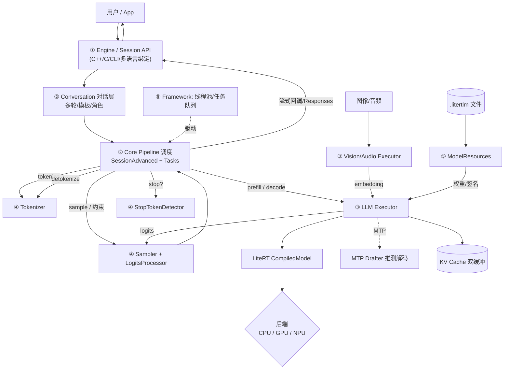

# 架构综述素材（synth）

> 来源同上；素材，非正文。

## 总览
LiteRT-LM 是 Google 面向端侧（Android / iOS / Web / Desktop / IoT）的大语言模型运行时，可以理解为“在 LiteRT(原 TFLite) 之上、专为 LLM 打造的编排层”。它要解决的核心问题是：让同一套 LLM （Gemma、Llama、Phi、Qwen 等）在资源受限、硬件五花八门的设备上，既跑得动、又跑得快。
它的设计哲学是清晰的分层 + 可插拔后端 + 统一抽象。最上层是稳定简洁的 Engine/Session API；中间是把请求拆成 prefill/decode 的核心调度 Pipeline；再往下是屏蔽 CPU/GPU/NPU 差异的 Executor；最底层借助 LiteRT CompiledModel 调度到具体硬件。每一层都用抽象接口隔离实现，所以新增一个后端、换一个 tokenizer、加一种采样策略，都不会震动其它层。
围绕“在端侧把 LLM 跑快”这个目标，它内置了一整套优化：KV cache 双缓冲、GPU 片上采样、推测解码(MTP)、量化(int4/int8)+FP16 激活、prefill 分块与异步可取消、权重缓存。多模态(视觉/音频经编码器转 embedding 注入)、工具调用(function calling)、约束解码(llguidance)、LoRA 适配也都以组件形式挂接进同一条流水线。
最后，它通过 C API 向上桥接出 Python / Kotlin / Swift / JavaScript / Rust 多语言绑定，并以一个 .litertlm 单文件分发模型——让“同一个引擎、各端复用”成为现实。它已在 Chrome、Chromebook Plus、Pixel Watch 等产品中投产。

## 分层
- **① 对外接口层 · Public API**：稳定的 Engine/Session 抽象 + CLI + C API + 各语言绑定。使用者只跟这一层打交道：加载模型、开会话、生成。  〔模块：engine-api, bindings〕
- **② 对话与会话编排层 · Conversation / Core**：把多轮对话、聊天模板、角色管理转成模型输入，并把一次请求编排成 prefill→decode 的有状态流程；负责克隆、检查点、流式回调。  〔模块：conversation, core-pipeline〕
- **③ 推理执行层 · Executor**：运行时的发动机：用 LiteRT CompiledModel 真正执行 Transformer，管理 KV cache，做片上采样与推测解码，屏蔽 CPU/GPU/NPU 差异；含文本与多模态执行器。  〔模块：executor-llm, executor-multimodal〕
- **④ 组件层 · Components**：可复用的算法零件：tokenizer、采样器、logits 处理/约束解码、停止符检测、模型资源装载、LoRA、embedding 查表、图像预处理、工具调用。  〔模块：components-text, components-resources〕
- **⑤ 格式与基础设施层 · Format & Infra**：.litertlm 模型文件格式与读取、能力描述(speculative decoding)；以及线程池/任务队列/资源注册等并发基建；外加构建系统与文档。  〔模块：schema-format, framework, build-docs〕
- **⑥ 横切主题 · Cross-cutting**：贯穿各层的端侧 LLM 推理知识与优化：KV cache、推测解码、量化、后端加速、约束解码、工具调用、多模态、LoRA。  〔模块：concepts〕

## 端到端流程
- **1. 创建引擎与会话**：用户用 ModelAssets 指向 .litertlm，EngineSettings::CreateDefault 选后端，Engine::CreateEngine 加载模型并经 EngineFactory 选出后端实现，CreateSession 开一个有状态会话。  〔runtime/engine/engine.h, engine_settings.cc, engine_factory.h; runtime/core/engine_advanced_impl.cc〕
- **2. 发起生成请求**：调用 Session::GenerateContent(contents)（阻塞）或 GenerateContentStream(contents, callback)（流式）。contents 是文本/图像/音频输入的序列。  〔runtime/engine/engine.h, io_types.h; runtime/core/session_advanced.cc〕
- **3. 套对话模板 + 预处理**：SessionAdvanced 判断是否首轮决定 ContentType，ApplyPromptTemplates 套 user/model 前后缀(首轮补 BOS)，PreprocessContents 把文本经 tokenizer 编码成 token-id TensorBuffer，图像/音频则透传其已编码的 embedding。  〔runtime/core/session_utils.cc; runtime/conversation/prompt_utils.cc; runtime/components/sentencepiece_tokenizer.cc〕
- **4. 多模态编码（若有）**：图像经 vision executor、音频经 audio executor 编码成 embedding，再经 FillVisionEmbeddings 注入 LLM executor，与文本 token 拼成统一的 ExecutorInputs。  〔runtime/executor/vision_litert_compiled_model_executor.cc, audio_litert_compiled_model_executor.cc; runtime/components/preprocessor/〕
- **5. Prefill（吞入提示词）**：任务经 ExecutionManager 投递到工作线程，Tasks::Prefill 调 executor.Prefill：选合适 prefill signature 或分块，跑 CompiledModel，一次性把整段提示词写进 KV cache，记录最后一个 token 作为 decode 起点。  〔runtime/core/tasks.cc; runtime/executor/llm_litert_compiled_model_executor.cc; runtime/framework/execution_queue.cc〕
- **6. Decode 自回归循环**：Tasks::Decode 进入 while 循环，每步 DecodeOneStep::Run：内部采样走 executor.Decode 直接出 token；外部采样走 executor.DecodeLogits → LogitsProcessor(重复惩罚/约束解码) → Sampler(top-k/top-p/温度) → tokenizer。每步把新 token 的 K/V 滚进 KV cache，current_step+1。  〔runtime/core/tasks.cc; runtime/components/top_p_cpu_sampler.cc, logits_processor/〕
- **7. 推测解码加速（可选）**：若模型带 MTP drafter，drafter 一次草拟多 token，base 模型用 verify signature 一次性验证并接受最长匹配前缀——一次大模型前向产出多 token。  〔runtime/executor/llm_litert_mtp_drafter.cc; schema/capabilities/speculative_decoding.cc〕
- **8. 停止判定**：每步用 StopTokenDetector 检测停止 token（含跨 step 的部分匹配回吐），ShouldStop 还检查 max_output_tokens、KV cache 上限、benchmark 步数、外部 cancel 标志。  〔runtime/components/stop_token_detector.cc; runtime/core/tasks.cc〕
- **9. detokenize + 流式回吐**：新 token 经 tokenizer 解码成文本片段，累积进 Responses 或经回调即时上报（处理 BPE 半截 token 的 MergeTokenIds）。流式回调最终收到 kDone/kCancelled。  〔runtime/components/sentencepiece_tokenizer.cc; runtime/conversation/conversation.cc; runtime/engine/io_types.cc〕
- **10. 状态留存**：KV cache 与 step 留在 LlmContext 里供下一轮复用；如需可 Clone(会话分叉)、SaveCheckpoint/Rewind(回退)。  〔runtime/core/session_advanced.cc; runtime/executor/kv_cache_interface.h〕

## 设计亮点
- **彻底的分层 + 抽象隔离**：API / 编排 / 执行 / 组件 / 格式 五层各用接口隔离，换后端、换 tokenizer、加采样策略都不震动其它层。
- **可插拔后端工厂**：EngineFactory 静态自注册 + 按 Backend 分派 executor，一套源码无缝覆盖 CPU/GPU/NPU。
- **状态即对象(LlmContext)**：把 KV cache + step + 配置打包成可 Clone/Serialize 的上下文，优雅支撑多轮、会话分叉、检查点与回退。
- **性能为先的执行器**：KV cache 双缓冲、GPU 片上采样、MTP 推测解码、prefill 分块异步可取消——端侧延迟优化做到细节。
- **统一抽象 + 单文件分发**：C API 向上长出多语言绑定，.litertlm 单文件打包一切，做到‘一个引擎，各端复用’。
- **可测试性**：FakeLlmExecutor、丰富的 *_test.cc 让核心算法可脱离真实模型/硬件做单测。

## 全局术语（90 条底本节选，写作时并入 appendix/glossary.md）
- **Engine / Session**：Engine 是重量级、可共享的模型资源持有者；Session 是轻量、有状态的一次对话(持 KV cache 与采样配置)。
- **Prefill**：把整段提示词一次性并行喂入模型、批量填充 KV cache 的阶段（计算密集、可并行）。
- **Decode**：逐 token 自回归生成的阶段，每步只算一个新 token（访存密集、串行）。
- **KV Cache**：缓存历史 token 的注意力 Key/Value，避免每步重算整段，是自回归 LLM 的核心提速结构。
- **Speculative Decoding / MTP**：用便宜的 drafter 一次猜多 token、大模型一次验证；MTP(Multi-Token Prediction)是其单模型变体，Gemma 4 提速约 3x。
- **CompiledModel / Signature**：LiteRT 针对目标后端编译出的模型；signature 是其具名入口(prefill/decode/verify)。
- **Backend**：执行后端：CPU / GPU / NPU（及 ARTISAN 手写算子路径）。同一模型可换后端运行。
- **量化 (Quantization)**：把权重降到 int4/int8 以压体积、提带宽利用率；配合 FP16 激活进一步省算力显存。
- **Sampler**：从 logits 选下一个 token 的策略：greedy / temperature / top-k / top-p，可在 GPU 片上完成。
- **约束解码 (Constrained Decoding)**：用语法(llguidance)在每步屏蔽非法 token，强制输出符合 JSON/正则等结构。
- **Tool Use / Function Calling**：让模型输出结构化函数调用，由运行时解析(含 ANTLR 语法)并回填结果，支撑 agentic 工作流。
- **LoRA**：低秩适配器：在不改动基座权重的前提下挂载小增量权重实现领域微调，可热加载。
- **.litertlm**：单文件模型容器：FlatBuffer header + 分段(section)，打包权重、tokenizer、元数据与能力描述。
- **Tokenizer**：文本↔token-id 的双向转换，支持 SentencePiece 与 HuggingFace 两种。
- **Embedding 注入**：图像/音频先经编码器转成 embedding，再像文本一样注入 LLM，实现多模态。

## 架构图 Mermaid 源（第 2 章将重制为书版 SVG）
