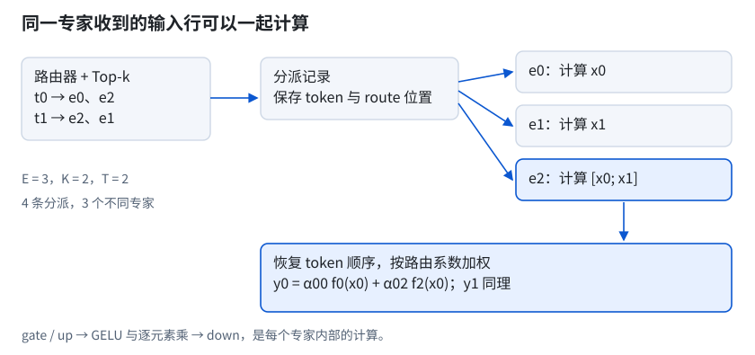
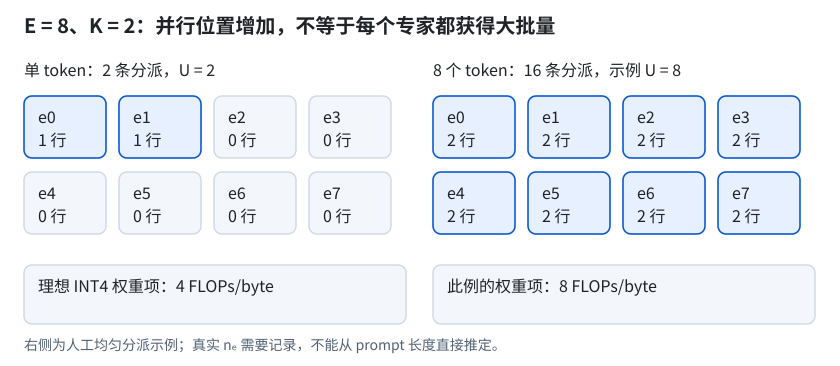

# 第 10 章　端侧 MoE：稀疏激活、专家执行与内存管理

一个模型有 30B 总参数，每个 token 激活 2B 参数，并不意味着设备只需容纳 2B 权重。未参与本次计算的参数仍属于模型；它们是否驻留内存、下一步会不会被访问，取决于路由结果与执行方式。

前几章分别计算了 KV cache、权重和异构执行的成本。第 9 章讨论一次验证多个 token，以分摊权重读取开销。本章转向另一种结构：每个 token 只使用部分专家。两种方法都会改变权重访问，但改变的是不同的量；把它们组合起来时，需要重新计算专家工作集。

## 10.1　总参数与激活参数

混合专家模型让不同的输入使用不同的参数子集。MoE 中的专家（expert）通常是一组前馈网络参数；对某个 token，可以只执行选中的几个专家。这里的“专家”是网络结构中的参数分组，不保证对应人能命名的某个知识领域。

本章讨论用稀疏专家前馈层替换部分稠密前馈层的 Transformer。注意力层及其他共享计算仍然存在。设模型共有 \\(L_m\\) 个这样的层，每层有 \\(E\\) 个等大的路由专家，每个专家包含 \\(P_e\\) 个参数，每个 token 选择 \\(K\\) 个不同专家。将始终参与前向的参数合计为 \\(P_s\\)，其中包含路由器和可能存在的共享专家参数，则简化模型中的参数量为：

$$
P_{\mathrm{total}}=P_s+L_m E P_e,\qquad
P_{\mathrm{active}}=P_s+L_m K P_e.
$$

这里把各层专家数和大小设为相同，只为便于验算。实际模型可以逐层求和；embedding 的统计口径也要单独核对。总参数量（total parameters）描述模型包含多少参数；激活参数量（active parameters）描述一次前向所选择的参数范围。两个数字都没有包含权重表示、访问次数和缓存状态。

以 30B／2B 为假设算例，B 按 \\(10^9\\) 个参数计。若所有参数都用理想 INT4 保存，每参数占 0.5 字节，则：

$$
\begin{aligned}
W_{\mathrm{total}}&=30\times10^9\times0.5/2^{30}
 \approx13.97\ \mathrm{GiB},\\
W_{\mathrm{active}}&=2\times10^9\times0.5/2^{30}
 \approx0.93\ \mathrm{GiB}.
\end{aligned}
$$

13.97 GiB 是全部权重的理想表示大小。0.93 GiB 是所选参数按同一位宽换算出的字节数，既不是进程内存，也不是每步实测读取量。这两个数是教学演算，不代表某款手机或模型的实际部署配置；量化 scale、对齐填充和高精度保留层尚未计入。

若后端准备了全部专家的设备缓冲，即使每个 token 只用其中一小部分，缓冲也可能覆盖全量权重。反过来，mmap 可以建立全量地址映射而暂不让每个页面驻留，后续触页仍会发生读入。第 7 章区分的文件大小、映射范围和物理驻留量，在 MoE 中仍须分别记录。

因此，30／2 的比值只给出两个参数统计值之比。它不能直接转化为 15 倍加速：共享计算不会随路由专家数同比缩小，路由和分派还会增加操作。低比特权重也可能先展开再计算。完整部署还要为第 6 章的 KV cache、激活、工作区和后端重排预留内存。

## 10.2　一次 MoE 前向计算

给定一个 token 的隐藏向量，模型先判断使用哪些专家，再合并这些专家的输出。路由器（router）产生每个专家的分数；Top-k 路由（top-k routing）从中选出 \\(K\\) 个专家及对应系数。这里的 Top-k 选择对象是专家，和第 5 章从词表中采样 token 的 top-k 不同。

设输入行向量为 \\(x_t\\)，长度为模型维度 \\(D\\)。路由器可通过一个线性投影得到 \\(E\\) 个分数，再得到所选专家集合 \\(S_t\\) 和系数 \\(\alpha_{t,e}\\)。是否先做 softmax、是否对选中系数重新归一化，属于模型定义；不能仅凭“Top-2”确定。Mixtral 的公开结构采用每层 8 个专家、每个 token 选择其中 2 个，其公式给出了具体的路由与加权方式。[^moe-mixtral]

本章用带门控的前馈专家说明计算。每个专家有 gate、up、down 三组矩阵，隐藏宽度为 \\(H\\)。gate 和 up 将 \\(D\\) 维输入映射到 \\(H\\) 维，down 再投影回 \\(D\\) 维。若矩阵分别记作 \\(W_{g,e}\\)、\\(W_{u,e}\\)、\\(W_{d,e}\\)，则：

$$
f_e(x_t)=\left[\phi(x_tW_{g,e}^{\mathsf T})
 \odot(x_tW_{u,e}^{\mathsf T})\right]W_{d,e}^{\mathsf T},
\qquad
y_t=\sum_{e\in S_t}\alpha_{t,e}f_e(x_t).
$$

\\(\phi\\) 是模型规定的激活函数，\\(\odot\\) 表示逐元素乘法。本章冻结的 CPU 专家实现接受 GELU 及其 tanh 近似，具体约束见 10.6 节。路由权重进入输出求和；若实现另外提供每专家缩放系数，也要纳入乘法，不能遗漏。

<figure>

<figcaption>图 10-1　路由先选择专家，执行器按专家聚合输入，再恢复 token 顺序并加权合并</figcaption>
</figure>

图 10-1 中只有 3 个专家，每个 token 选择 2 个。token 0 选择专家 0 和 2，token 1 选择专家 2 和 1。按输入顺序逐条调用也能得到结果，但专家 2 会被调用两次。执行器可以把选中同一专家的输入行汇集起来，让专家 2 一次处理两行。

这种 token 分派（token dispatch）改变张量排列，不改变路由决定。分派记录需保留专家输出与原 token、路由系数的对应关系。本章 CPU 实现为此保存 token 位置和所选路由的位置。专家计算完成后，执行器按记录和路由系数，将结果加权累加到对应输出行。若只保存专家编号，两个 token 的输入仍然可以计算，输出却可能被合并到错误的位置。

并非所有专家都必须参与 Top-k 选择。模型也可以设置每次都执行的共享专家；此时输出还包含共享分支，其参数计入 \\(P_s\\)。共享分支的计算成本也须单独统计。共享专家和细粒度路由专家在公开的 DeepSeekMoE 结构中有明确区分。[^moe-deepseek] 本章后续的 \\(E\\)、\\(K\\) 均只统计需要路由的专家。

## 10.3　容量、计算与访问成本

同一层里，专家数量影响三种不同的成本。增加 \\(E\\) 会增加模型保存的参数；增加 \\(K\\) 会增加单个 token 的专家计算。实际访问量还取决于一批 token 触及多少专家，以及这些专家的权重当前在哪里。

设一次调用处理 \\(T\\) 个 token，专家 \\(e\\) 收到 \\(n_e\\) 行输入。每个 token 选择 \\(K\\) 个专家时，分派总数为 \\(\sum_e n_e=TK\\)。单个门控专家有约 \\(3DH\\) 个矩阵参数，忽略偏置。按一次乘加计 2 FLOPs，专家矩阵计算合计为：

$$
F_{\mathrm{experts}}\approx 6TKDH\quad\mathrm{FLOPs}.
$$

这个表达式没有计入路由投影、激活函数、加权合并和注意力。线性路由投影本身约需 \\(2TDE\\) FLOPs，还要读取路由权重。因而固定 \\(K\\) 增加 \\(E\\)，只能说专家矩阵乘的理想计算量不变，不能说整个模型的计算量完全不变。

将本次调用涉及的不同专家数记为 \\(U=|\bigcup_t S_t|\\)。若每个专家权重在本次调用中只读一次，每参数存储字节数为 \\(b_w\\)，专家权重的理想读取量为 \\(3UDHb_w\\) 字节。相应的权重项算术强度为：

$$
I_{\mathrm{weights}}\approx
\frac{6TKDH}{3UDHb_w}=\frac{2TK}{Ub_w}
\quad\mathrm{FLOPs/byte}.
$$

这只是权重项的模型。它假定按专家聚合了输入，并且没有重复解包或重排。真实算术强度的分母还要加上输入输出、分派记录及中间张量的读写。若权重从存储设备换入，存储到主存和主存到计算单元是两段不同的传输，不能混用同一个带宽值。

**表 10-1　参数规模、工作集与运行指标之间不能相互替代**

| 观察量 | 简化模型中的主要决定因素 | 尚不能据此确定的量 |
|---|---|---|
| 全部权重的表示大小 | 共享参数、各层全部专家、位宽及量化元数据 | 进程 RSS、GPU 分配量 |
| 单 token 专家计算 | 每层选中专家数 \\(K\\)、专家矩阵大小 | 单步时延、能耗 |
| 一次调用的专家权重集 | 不同专家数 \\(U\\)、权重布局和表示 | 实际主存读取量、缺页量 |
| 分派与中间激活 | \\(TK\\) 条分派及各专家的 \\(n_e\\) | 后端工作区的具体峰值 |
| KV cache | 注意力结构、上下文长度与预留形状 | 不随 \\(K/E\\) 自动缩小 |
| 持续生成体验 | 计算、传输、同步、路由序列和设备状态 | 不能由激活参数量单独预测 |

用一个假设层比较这些成本：\\(E=8\\)、\\(K=2\\)、\\(D=2048\\)、\\(H=1024\\)，权重为理想 INT4。单专家包含 6,291,456 个参数，大小为 0.00293 GiB；全部专家约 0.02344 GiB。一个 token 选中的两份专家权重约 0.00586 GiB，而专家矩阵计算约为 25.17 MFLOPs。这里的 M 按 \\(10^6\\) 计。

若一次处理 8 个 token，且其选择覆盖全部 8 个专家，专家矩阵计算增至约 201.33 MFLOPs。理想权重读取量只增至约 0.02344 GiB，权重项算术强度从 4 增至 8 FLOPs/byte。在这组条件下，增加 token 数使权重项算术强度提高两倍；不能沿用“同一批权重供 8 个位置共用”的稠密模型估算。

运行内存需要另列预算：源权重的实际驻留、后端权重副本、KV cache、激活和临时工作区各占多少。若其中两项共享同一底层分配，就只计一次。10.6 节会给出一个具体例子：源权重保存低比特表示，当前专家却被展开到 FP32 临时缓冲，压缩权重与展开后的临时权重同时存在。

## 10.4　Prefill 与 decode

prefill 的输入位置可以并行计算，但它们不一定选择相同的专家。稠密层把多行输入交给同一组矩阵，MoE 层则先将这些行分散到不同专家。第 4 章中“扩大输入块可增加权重复用”的判断，在这里需要加上专家分布这一条件。

每个专家最终收到 \\(n_e\\) 行，其矩阵乘形状分别近似为 \\([n_e,D]\times[D,H]\\) 和 \\([n_e,H]\times[H,D]\\)。即使总输入 \\(T\\) 很大，一些专家也可能只收到一两行。GPU 是否能得到足够大的矩阵任务，取决于这些实际形状，而不只取决于 prompt 长度。

<figure>

<figcaption>图 10-2　输入位置增多时，专家并集与每专家行数共同决定权重复用</figcaption>
</figure>

假设每个 token 独立、均匀地从 \\(E\\) 个专家中选择 \\(K\\) 个不同专家。某个专家未被一个 token 选中的概率为 \\(1-K/E\\)，未被全部 \\(T\\) 个 token 选中的概率为 \\((1-K/E)^T\\)。因此，专家并集大小的期望为：

$$
\mathbb E[U]=E\left[1-\left(1-\frac KE\right)^T\right].
$$

对于 \\(E=8,K=2\\)，单 token 的并集就是 2；处理 8 个 token 时，期望约为 7.20。它是多次随机选择的平均值，单次调用仍只会出现整数个专家。真实路由会受内容、层位置和训练影响，均匀独立假设只是一个可计算的参照，不能当作模型的路由统计。

当多行集中到少数专家，权重复用较多，其他专家没有工作。若实现逐专家串行执行，这主要改变各次矩阵乘的大小。若后端并行处理多个专家，负载不均衡（load imbalance）还可能让最忙的专家决定完成时刻。训练中的负载均衡约束不保证某条端侧请求在每一步都均匀分派。

decode 通常一次只加入一个新 token，本层只选择 \\(K\\) 个专家。但相邻 step 可以选择不同集合，持续生成所涉及的专家会累积。一次短输出中没有访问某个专家，不代表长对话也不会访问它。据短窗口推算长期内存或缓存命中率，需要额外的路由记录。

第 9 章的批量验证也会扩大专家并集。候选 token 即使最终被拒绝，也可能已经在验证前向中触发专家计算和权重读取。因此，MoE 与 MTP 的组合收益必须同时记录接受比例、验证调用的专家并集和草拟成本。仅把激活参数量代入稠密模型的验证耗时，无法解释额外的专家访问。

prefill chunk size 也会改变专家访问量和临时内存。块太小，每个专家的输入行数少，下一块可能再次读取同一专家。块太大，分派记录和中间张量占用增加，还可能触及更多专家。选择块大小时应同时观察首 token 时延和内存峰值，不能仅按 decode 的单步工作集配置。

## 10.5　专家权重的驻留与搬运

稀疏计算只有避开不需要的数据传输，才可能减轻带宽压力。若每次调用都把全部专家复制到设备，即使 kernel 只执行其中两个，仍需传输全量权重。本节讨论几种可选的存储设计；冻结版 LiteRT 已实现到哪一步，在 10.6 节单独核对。

全量驻留把所有专家保留在可供后端访问的内存中。它需要较大的容量，但不必在路由确定后等待专家从存储设备读入。主存已有权重仍不等于片上缓存已有权重；decode 的主存访问与 10.3 节的专家工作集依然相关。

按需加载把不常用专家留在较慢的存储层，等选择结果确定后才准备它们。若从文件换入，还会涉及文件页面、访问粒度和读入顺序。假设本步需要的专家共 0.00586 GiB，按理想连续读入估算时，先换算成字节，再除以实测存储带宽。小块随机读、缺页处理和后端布局转换都会增加耗时，不能把存储厂商公布的顺序读取带宽直接代入。

保留已经准备过的专家，就形成专家缓存（expert cache）。它与第 7 章的编译后 weight cache 不是同一概念：这里按运行时专家访问管理驻留集合。容量必须同时说明保存多少专家、使用哪种表示，以及共享层和临时区占用了多少内存。只报告“能缓存 4 个专家”，不足以复算字节预算。

**表 10-2　专家驻留方案改变的是容量需求和等待位置，收益均依赖访问模式**

| 方案 | 可以减少的成本 | 额外条件与代价 |
|---|---|---|
| 全量驻留 | 路由后的存储换入等待 | 容量覆盖全量表示及后端副本 |
| 按需加载 | 尚未访问专家的驻留量 | 未命中时发生读入、布局转换及同步 |
| 有限专家缓存 | 重复访问专家的换入 | 需要命中统计、淘汰策略和明确容量上限 |
| 预取 | 预测正确且能重叠时的等待 | 预测错误浪费带宽和容量，还可能挤出即将需要的专家 |

预取（prefetch）必须在专家真正使用之前发起。本层的路由依赖本层输入，下一层的输入又依赖当前层输出。提前加载可以使用预测或已经确定的部分信息，但预测依据、提前量和失败成本都需要验证。没有足够可重叠的计算，异步接口本身不会消除等待。

<figure>

<figcaption>图 10-3　缓存未命中增加等待，预取只有提前完成且预测正确时才能覆盖换入成本</figcaption>
</figure>

可以先建立一个近似时延模型。设计算与固定分派耗时为 \\(t_c\\)，本步仍需换入的字节数为 \\(B_{\mathrm{miss}}\\)，有效传输带宽为 \\(\beta\\) 字节每秒。若最多可覆盖 \\(t_o\\) 秒传输时间，则额外等待可近似为：

$$
t_{\mathrm{wait}}\approx
\max\left(0,\frac{B_{\mathrm{miss}}}{\beta}-t_o\right),
\qquad t_{\mathrm{step}}\approx t_c+t_{\mathrm{wait}}.
$$

这不是完整的硬件模型。计算和传输可能竞争同一内存带宽，多个专家也可能分批到达；此时不能独立相加。它的用途是明确需要测量什么：本步缺多少字节、读入用了多久、究竟有多少传输发生在可重叠区间。

平均命中率相同的两条请求，停顿分布也可能不同。未命中若分散在多个 step，额外等待也可能分散出现。若在切换话题时集中未命中，就可能形成一段较长停顿。持续生成应保存逐 step 时延及路由序列，并分别报告中位数、高分位和最大值。平均 tokens/s 会掩盖这些位置上的差异。

## 10.6　LiteRT 的实现

LiteRT-LM 编排会话、输入和生成循环，专家层的具体执行位于它依赖的 LiteRT。本章沿用全书的 LiteRT-LM v0.17.0，并锁定其依赖提交 `9fe5be45564c868408e6514c8aabb83e211a0911`。下述 CPU/GPU 结论来自这个版本的代码；出现执行路径，不表示任意 MoE 模型都已能经 LiteRT-LM 完成端到端生成。[^moe-dependency]

转换器与运行时需要就同一份算子契约达成一致。冻结版运行时识别名为 `moe` 的自定义算子（custom op）。输入包括激活、已经选好的专家索引与路由权重，以及专家矩阵。路由分数计算和 Top-k 选择在该算子之外；不能把它理解成一个包含全部路由过程的独立 MoE 层。[^moe-cpu]

### 10.6.1　算子契约与集成边界

FP32 权重模式有 7 个输入：激活、路由权重、专家索引、gate 权重、up 权重、down 权重、每专家缩放系数。量化模式在三组权重之后分别插入 scale，合计 10 个输入。CPU 要求激活、路由权重和输出为 FP32，索引为 INT32；权重及缩放张量为只读常量。支持的权重模式为 FP32、INT8、INT4，激活函数为 GELU 或 GELU 的 tanh 近似。[^moe-cpu]

输入顺序还不足以描述布局。gate/up 的逻辑权重排列是 \\([H,E,D]\\)，down 是 \\([D,E,H]\\)，专家轴位于输出行与输入维度之间。按专家访问时，需要从这些行中取出对应片段；不能假定每个专家天然占据一个连续的大块。量化分组、scale 排列和 INT4 半字节编码也必须匹配消费方。[^moe-cpu]

自定义算子被解析后，还需要由可执行的 kernel 接管。LiteRT 的 CPU 编译路径注册了 `moe` 占位算子，其 Prepare 返回成功，实际 Invoke 则报错；需要由支持该节点的 delegate 接管执行。XNNPACK 检查节点名和支持条件，将符合条件的 MoE 节点交给专用 kernel。该分派代码没有以专用 MoE 开关为前提。[^moe-registration]

部署验证至少包含三项检查。转换产物须符合输入契约，目标后端须接受该算子，实际输出须与参考结果一致。模型加载成功只能覆盖其中的一部分。10.7 节分别验证直接构造的算子与真实导出的小型专家模块；两组实验都没有包含完整语言模型。

另取 litert-torch 提交 `d592a2f09da4839ea34daaef92e53e638b57090a` 核查导出端。该版本封装的 FP32／INT8 输入顺序及权重布局与上述契约对应，但不提供同一路径的 INT4 包装分支。[^moe-export] 本书用该版本导出的小型 INT8 模块保留了独立 scale 输入。其权重张量没有量化 scale 与 zero point 元数据，不满足下述 GPU parser 的仿射量化要求。CPU 执行成功不能证明 GPU 支持。导出环境与产物检查见附录 D 第十八节。

导出配置也可能改变计算方式。该版本的 `split_cache` 配置会将专家实现改为顺序封装，逐个专家做稠密运算后按 mask 累加。因而分析产物时必须确认使用了哪条实现，不能只根据原模型属于 MoE，就认定导出后会跳过未选专家。[^moe-export-config]

### 10.6.2　CPU：按专家分派与临时权重展开

CPU kernel 先按专家编号统计分派数量，再求前缀和，将 token 与 route 位置填进连续记录。相同专家的记录落在同一段中，未收到输入的专家可以跳过。实际执行顺序在这段循环里可直接看到：[^moe-cpu]

```cpp
// LiteRT/tflite/delegates/xnnpack/moe_delegate_kernel.cc:420-434
    for (int expert = 0; expert < attr_.num_experts; ++expert) {
      const int begin = expert_offsets_[expert];
      const int end = expert_offsets_[expert + 1];
      const int routed_tokens = end - begin;
      if (routed_tokens == 0) {
        continue;
      }
      if (!RunExpert(context, expert, assignments_.data() + begin,
                     routed_tokens, src, top_weights, gate_weight, gate_scale,
                     gate_scale_elements, ff1_weight, ff1_scale,
                     ff1_scale_elements, linear_weight, linear_scale,
                     linear_scale_elements, per_expert_scale, output)) {
        return kTfLiteError;
      }
    }
```

循环按专家编号依次调用 `RunExpert`。矩阵乘可使用线程池，但这一循环不是把多个专家同时派给独立线程执行。对每个有输入的专家，kernel 先汇集输入行，执行 gate/up 投影、激活与逐元素乘法，再执行 down 投影。随后按路由权重和每专家 scale，将结果累加回原 token 的输出行。

低比特权重进入矩阵乘之前的准备过程，也会产生时间和内存开销。实现把当前专家的 gate/up 权重复制或反量化到一个 float 缓冲，然后调用动态 FP32 全连接算子：[^moe-cpu]

```cpp
// LiteRT/tflite/delegates/xnnpack/moe_delegate_kernel.cc:816-823
    CopyGateUpExpertWeight(gate_weight, gate_scale, gate_scale_elements,
                           ff1_weight, ff1_scale, ff1_scale_elements, expert);
    if (!RunDynamicFullyConnected(context, gate_up_fc_.get(), routed_tokens,
                                  attr_.model_dim, 2 * attr_.hidden_dim,
                                  routed_src_.data(), kernel_buffer_.data(),
                                  gate_up_.data())) {
      return false;
    }
```

down 投影随后复用这个权重缓冲。三个投影不是直接在源 INT4/INT8 数据上完成低比特矩阵乘；源文件的压缩表示与当前专家的 FP32 表示会同时存在。对于 gate/up，临时权重元素数至少为 \\(2DH\\)，仅该缓冲对应 \\(8DH\\) 字节，XNNPACK 自身的打包和工作区另计。

代入 10.3 节的 \\(D=2048,H=1024\\)，gate/up 的 FP32 临时权重就约为 0.01563 GiB。它大于单专家三组理想 INT4 权重的 0.00293 GiB。两者覆盖的投影范围不同，比较的目的只是说明：即使只处理当前专家，展开表示也能成为内存预算中的独立大项。

输入汇集区、gate/up 输出、down 输出及工作区会按需要扩容并复用。成员 vector 的增长逻辑没有在本次输入减少时缩回去，因此一次较大的 prefill 可能留下后续 decode 不再需要的容量。这些临时缓冲保留此前扩容得到的容量，并未按专家编号缓存已展开权重。[^moe-cpu]

每次处理选中的专家仍会执行复制或反量化。此 kernel 中没有专家权重缓存的命中表、淘汰规则或预测预取，也没有根据路由从磁盘换入专家的调度。源张量仍然包含所有专家；其页面是否驻留，要结合外层加载与操作系统行为判断。不能据“跳过无输入专家”推导出“只加载 K 个专家”。

### 10.6.3　GPU：重排、专家计算与输出合并

GPU 的专家计算图同样接收外部已经选择好的索引和系数。构图逻辑把 token 行与专家选择关联起来，再建立专家全连接、门控激活和输出合并。构图时以分派数是否超过专家数为界：当 \\(TK>E\\) 时使用按专家分组的 remap 路径，否则先汇集输入行，再用专家索引选择权重。这个判断使用张量形状，不区分 prefill/decode 名称，也不比较两条路径的实测速度。[^moe-gpu]

专家计算后的结果可按 \\([1,T,K,D]\\) 理解，路由权重对应 \\([1,T,1,K]\\)。最后一次批量矩阵乘沿 \\(K\\) 这一维完成加权求和，输出恢复为每个 token 一行。这段形状设置说明了专家输出如何与路由系数对应：[^moe-gpu]

```cpp
// LiteRT/ml_drift_delegate/delegate/composite/moe_experts_kernel.cc:336-345
  auto reshaped_top_weights = model_builder->Reshape(
      top_weights, ::ml_drift::BHWC(1, sequence_size, 1, num_active_experts));
  auto reshaped_expert_outputs = model_builder->Reshape(
      expert_outputs,
      ::ml_drift::BHWC(1, sequence_size, num_active_experts, model_dim));
  ABSL_ASSIGN_OR_RETURN(auto combined,
                        model_builder->BatchedMatMul(reshaped_top_weights,
                                                     reshaped_expert_outputs));
  combined = model_builder->Reshape(combined, output_shape);
  return model_builder->UpdateOutputTensor(combined, output_id);
```

分组路径需要映射表、计数、偏移，以及重排后的输入输出等临时张量。其映射表的一个形状为 \\([1,E,T,2]\\)，所以减少未选专家的计算并不意味着所有工作区都只随 \\(K\\) 增长。内层采用全连接还是特定矩阵实现，还受每专家任务规模和设备能力影响。[^moe-remap]

激活函数还存在一个必须单独核对的数值边界。导出参考使用 GELU 的 tanh 近似，却把算子属性写成 `gelu`；GPU 对应实现也固定使用 tanh 近似。CPU 则将 `gelu` 与 `gelu_tanh` 分别处理。[^moe-export] [^moe-cpu] [^moe-gpu] 10.7 节的小型导出实验观察到了这种差异。在该实验的诊断副本中，仅将激活属性改为 `gelu_tanh`，CPU 结果便通过了参考比较。但 GPU parser 不接受该属性值，因此这项修改不能通用于两个后端。

GPU parser 对量化权重要求仿射量化元数据及全零 zero point，独立 scale 对应每专家、每输出通道；这与 CPU 可接收的 INT4 分组配置不是同一范围。它接受的激活属性也只有 `gelu`。这些支持检查应当在性能测量之前完成。[^moe-gpu-parser]

GPU 代码为量化专家权重建立描述与转换步骤，不能由此套用 CPU 的“先展开为 FP32”结论。反过来，构图代码也不足以证明某设备最终选用了原生 INT4 指令，或全模型都留在同一 GPU 路径上。需要结合生成的 kernel、实际后端与分配记录验证。[^moe-gpu]

上述代码说明了 LiteRT 如何构建 GPU 专家计算图。本书附录 D 第十六节的 Mac E4B 基准走 WebGPU/Metal，不能拿那组结果证明此 MoE 路径的吞吐，更不能推断手机 NPU 的支持情况。完整 MoE 模型的转换、后端覆盖和持续运行，需要单独建立实验记录。

公开模型产物也要核对执行路径。LiteRT Community 发布的 Gemma 4 26B-A4B LiteRT-LM 模型卡说明了 Web 文本部署能力。[^moe-gemma-artifact] 本书读取冻结版本中 GPU、Web 两个文件的容器头。两者均将文本模型标为 `tf_lite_artisan_text_decoder`，后端约束为 `gpu_artisan`。v0.17.0 的 `EngineSettings::CreateDefault` 检测到这种模型时，会把请求的 GPU 改为 `GPU_ARTISAN`。[^moe-artisan-selection] 这条路径与本节分析的专家构图路径须分别验证。容器核查记录见附录 D 第十八节。

本书还下载了 GPU 产物，校验完整文件后在 24 GiB 内存的 M5 Pro 上请求生成。v0.17.0 预编译包实际进入 Artisan／Metal 路径，成功创建引擎和会话。生成期间系统内存压力达到 critical，采集器按设定终止了进程，没有取得完整响应。系统压力受同机其他程序影响，不能把这次停止换算成模型的独立内存需求，也不能据此判断引擎不兼容。该结果确认了产物能够进入生成流程，尚未验证输出质量、持续性能，也未确认本节分析的专家构图路径是否覆盖该产物。完整记录见附录 D 第二十节；文件名带 `-web` 的另一份产物未做完整运行测试。

模型文件名与浏览器运行时也要分别核对。模型卡所链接的演示，在本书冻结的版本中使用 `-gpu` 文件，并加载随演示分发的 JavaScript／WASM 运行时。它不是 v0.17.0 预编译动态库，也不能由当前 Web SDK 文档推定其行为。[^moe-web-demo] 本书在同一 M5 Pro 上用该演示运行时测试，26B 产物在引擎创建阶段触发持续 warning 内存压力保护，尚未完成加载。同运行时的较小 E4B GPU 产物则完成生成，返回 `OK<channel|>`，其中包含未清理的控制标记。这组对照说明本机可以执行该 WebGPU 运行时，但不能证明完整 26B MoE 已能运行。冻结资源、保护条件和日志见附录 D 第二十四节。

## 10.7　如何验证部署收益

最小正确性实验先固定路由，使算子错误与路由选择错误可以分别定位。给定输入、专家索引、路由系数和三组权重，直接逐 token、逐 route 计算 10.2 节的公式，作为参考结果；再让后端执行同一组数。先验证输出，随后才测量时延和内存。

本书在 Apple M5 Pro、macOS 26.5 上，使用 LiteRT-LM 0.17.0 的预编译动态库完成了 CPU 单算子验证。固定 \\(E=3,K=2,D=4,H=6\\)，改变 token 数、权重类型和 GELU 形式。23 个数值案例均实际完成 Invoke，最大绝对误差约为 \\(6.88\times10^{-9}\\)；另有 3 个非法输入案例按预期返回错误。输入、模型、输出与日志见附录 D 第十七节，复现步骤见附录 C 第七节。

这些小型产物由实验脚本直接构造，未经过 litert-torch 完整模型导出。实验使用默认 CPU 编译选项，日志确认 XNNPACK delegate；预编译包执行成功也不等于本地冻结源码构建成功。该结果不包含路由器、语言模型质量、GPU/NPU、吞吐或峰值内存测量。

真实导出还要与导出前的模块比较。在同一设备与动态库上，本书用 10.6.1 节冻结的 litert-torch 导出小型专家模块。FP32／INT8 权重分别搭配 1／2 个 token，共得到 4 份原始产物。它们均完成 CPU Invoke，但均未满足与 PyTorch 参考值的比较容差。FP32 两例的最大绝对误差约为 \\(9.87\times10^{-4}\\)，INT8 两例约为 \\(9.81\times10^{-4}\\)。这里比较的是专家层输出，不是语言模型的质量指标。

使用序列化权重，分别以两种 GELU 计算独立参考，可以核对激活语义。CPU 输出符合精确 GELU，PyTorch 参考符合 tanh 近似。为每份原始产物建立一个诊断副本，保持输入和权重不变，仅将激活属性改为 `gelu_tanh`。4 份诊断副本均通过了与 PyTorch 的比较。最大绝对误差降至约 \\(9.54\times10^{-7}\\)。这组对照支持将本例差异归因于激活语义，不能证明完整模型已经兼容。诊断副本不代表导出器的原始输出。产物、容差与逐例数据见附录 D 第十八节，复现步骤见附录 C 第八节。

正确性检查还应覆盖 token 顺序改变、同一专家接收多行、未选专家、非单位路由系数，以及量化边界。比较量化执行时，要以量化后再反量化的权重计算参考值；若只与原始浮点权重比较，量化误差和 kernel 错误就会混在一起。容差应同时报告绝对误差和相对误差，并说明零附近的相对误差如何处理。

输入输出标为 FP32，也不能省略运行精度的记录。在同一 Apple M5 Pro 上，两份 FP32 原始产物均由 WebGPU/Metal 接管。比较沿用附录 D 第十八节的容差。默认配置与显式 FP16 配置的输出逐元素相同，均未通过比较。显式选择 FP32 后，两份产物都通过了与 PyTorch 的比较，最大绝对误差不超过 `9.54e-7`。这说明应分别记录权重类型、接口张量类型和计算精度配置；仅写“FP32 模型”不足以复现实验。

后端覆盖则需要执行证据。这两份产物实际完成 GPU Invoke，接口确认没有 CPU 节点，日志记录了 Metal 设备。两份 INT8 产物因缺少仿射量化元数据而在 GPU 编译时被拒绝。另取 token 数为 2 的 FP32 `gelu_tanh` 诊断副本，也在编译时被拒绝。一次成功执行不能概括所有权重类型与激活配置。逐例日志与普通 ADD 对照见附录 D 第十九节，复现命令见附录 C 第九节。本组结果不包含完整模型或性能测量。

覆盖接口也不能代替后端错误检查。本书补充 INT8 产物的仿射元数据后，模型编译与运行 API 均返回成功，覆盖接口也为 true。但 WebGPU 日志报告缓冲绑定缺失和无效命令缓冲，1-token 配置另有着色器变量未定义错误。这些全零输出不能用于精度比较。将量化权重还原为 FP32 的对照通过了数值比较，本例的 INT8 路径仍未通过验证。诊断记录和复现见附录 D 第二十一节、附录 C 第十一节。

将隐藏维度从 6 截取为 4，或零填充至 8 后，INT8 GPU 仍出现相同的缓冲绑定错误。这个补测排除了“错误仅由隐藏维度不是 4 的倍数造成”的解释，尚未通过修补后的运行时确认根因，见附录 D 第二十三节。

小型专家层验证通过后，可以逐步接入模型导出、完整网络和生成循环。相同输入的首个不一致层，比最终生成文本更能定位布局或激活函数错误。若只在运行若干步之后发生差异，还要检查状态、形状变化及缓冲复用。出现不支持算子的回退或失败，则先定位后端覆盖范围。

同样的投影计算量可以对应不同的执行时间。本书在 M5 Pro、macOS 26.5 上，使用同一 v0.17.0 预编译动态库扩展了 FP32 单层实验，令 E=8、K=2、T=16、D=512、H=1024。全部 token 选择同两个专家时，CPU 和 WebGPU/Metal 显式 FP32 的同步耗时分别为 2.846、0.899 ms；路由循环覆盖八个专家时，分别为 7.755、1.073 ms。数字取三个新进程各自中位数的中位数，每个进程预热 3 次、测量 12 次。两种后端使用同一个 tanh-GELU 数学参考，计时包含输出等待与读回。

这组实验保持每个 token 的激活专家数不变，改变了专家并集和每专家接收的行数。按三组 FP32 投影权重计算，唯一选中专家权重从 0.01171875 GiB 增为 0.046875 GiB；该数值不等于实测内存流量。较小矩阵的 GPU 对照并不总是集中路由更快，因此还需结合 10.6.3 节的构图方式和实际矩阵形状解释。16 组配置、96 次进程运行的输出全部通过参考比较，统计范围和限制见附录 D 第二十二节。

验证性能时，保持设备、模型产物、量化、后端、上下文和生成设置可比较。prefill 至少改变输入 token 数并记录各专家收到的行数；decode 保存逐 step 的专家集合。还应分别记录进程是否新建、模型文件页是否驻留，以及后端是否已完成准备。对照时控制这些条件，避免把缓存差异解释为 MoE 结构收益。

内存记录需要对齐事件。在模型映射后、首次调用后、最长 prefill 后及持续 decode 后分别采样，可定位内存变化的阶段。要区分源权重驻留、一次性后端准备和临时缓冲扩容后的保留量，还需映射信息及缓冲分配记录。进程 RSS/PSS、GPU 分配和文件页的统计范围不同，按第 7、8 章的方法说明共享关系；不能直接把它们相加当作设备总占用。

端到端验收至少保留正确性或任务质量、首 token 时延、持续吞吐、逐 step 高分位时延和内存峰值。有可用的功率测量手段，再计算每个输出 token 的能耗；没有测量就保留为空。把 MoE 与稠密模型比较时，还应说明任务质量是否相当；相同激活参数量不是公平比较的充分条件。

部署报告应当能解释一个具体停顿：它发生在哪一步，选中了哪些专家，是否需要读入或重排权重，后端等待了什么。这些记录可帮助判断应调整专家驻留、prefill 分块还是算子实现。平均吞吐不能单独定位停顿原因。

## 小结

MoE 将总参数量与单 token 的参数选择范围分开，也使资源分析必须跟随实际专家访问。总参数决定权重保存规模，路由决定本次计算范围，后端布局与驻留策略决定数据如何到达计算单元。本章冻结的 CPU 实现提供了具体例子：它跳过未分派专家，却仍需为当前专家准备 FP32 临时权重。因此，30B／2B 这样的参数描述还需结合权重位宽、实际驻留和后端临时缓冲，才能换算为部署预算。

## 练习

1. 假设模型有 16 个 MoE 层，每层 8 个路由专家、每次选择 2 个。每专家 50M 参数，共享参数合计 400M。计算总参数量、激活参数量及理想 INT4 权重大小，并说明这些数为什么不足以确定运行内存。
2. 一层的 4 个 token 分别选择 `{0,1}`、`{1,2}`、`{2,3}`、`{0,3}`。求分派总数、专家并集与各专家收到的行数。若全部改为 `{0,1}`，哪些量改变？
3. 在 10.4 节均匀独立假设下，令 \\(E=16,K=2,T=8\\)，计算专家并集的期望。为什么不能直接用它预测真实模型的专家缓存命中率？
4. 一个实现保存全部 INT4 源权重，每次把当前专家展开为 FP32，执行后复用临时缓冲。它是否实现了“只驻留激活参数”？应采集哪些数据才能回答？
5. 两条请求的平均 decode 吞吐和缓存命中率相同，用户却感到其中一条停顿更多。设计记录方法，区分集中未命中、后端同步与设备降频。

[^moe-mixtral]: Albert Q. Jiang 等，[*Mixtral of Experts*](https://arxiv.org/abs/2401.04088)，2024-01-08，第 2 节；访问日期：2026-09-13。
[^moe-deepseek]: Damai Dai 等，[*DeepSeekMoE: Towards Ultimate Expert Specialization in Mixture-of-Experts Language Models*](https://arxiv.org/abs/2401.06066)，2024-01-11，第 2 节；访问日期：2026-09-13。
[^moe-dependency]: Google AI Edge，LiteRT-LM，[WORKSPACE 中的 LiteRT 依赖声明](https://github.com/google-ai-edge/LiteRT-LM/blob/e9fd8c53ff968071774206163027dd84bedfe925/WORKSPACE#L6-L8)，v0.17.0；访问日期：2026-09-13。
[^moe-cpu]: Google AI Edge，LiteRT，[CPU MoE 专家 kernel](https://github.com/google-ai-edge/LiteRT/blob/9fe5be45564c868408e6514c8aabb83e211a0911/tflite/delegates/xnnpack/moe_delegate_kernel.cc#L106-L889)，`tflite/delegates/xnnpack/moe_delegate_kernel.cc`，106–245、420–434、495–560、583–858、879–889 行；提交 `9fe5be45564c868408e6514c8aabb83e211a0911`；访问日期：2026-09-13。
[^moe-registration]: Google AI Edge，LiteRT，[CPU custom op 注册](https://github.com/google-ai-edge/LiteRT/blob/9fe5be45564c868408e6514c8aabb83e211a0911/litert/runtime/compiled_model.cc#L162-L172)，`litert/runtime/compiled_model.cc`，162–172、391–397 行；[XNNPACK 专家节点委托](https://github.com/google-ai-edge/LiteRT/blob/9fe5be45564c868408e6514c8aabb83e211a0911/tflite/delegates/xnnpack/xnnpack_delegate.cc#L7289-L7297)，7289–7297、7754–7788 行；提交 `9fe5be45564c868408e6514c8aabb83e211a0911`；访问日期：2026-09-13。
[^moe-gpu]: Google AI Edge，LiteRT，[GPU MoE 专家构图](https://github.com/google-ai-edge/LiteRT/blob/9fe5be45564c868408e6514c8aabb83e211a0911/ml_drift_delegate/delegate/composite/moe_experts_kernel.cc#L111-L348)，`ml_drift_delegate/delegate/composite/moe_experts_kernel.cc`，111–173、244–348 行；提交 `9fe5be45564c868408e6514c8aabb83e211a0911`；访问日期：2026-09-13。

[^moe-export]: Google AI Edge，litert-torch，[MoE 导出封装](https://github.com/google-ai-edge/litert-torch/blob/d592a2f09da4839ea34daaef92e53e638b57090a/litert_torch/generative/layers/moe.py#L125-L185)，`litert_torch/generative/layers/moe.py`，125–185、261–277、368–462 行；提交 `d592a2f09da4839ea34daaef92e53e638b57090a`（2026-09-11）；访问日期：2026-09-13。
[^moe-export-config]: Google AI Edge，litert-torch，[专家导出实现选择](https://github.com/google-ai-edge/litert-torch/blob/d592a2f09da4839ea34daaef92e53e638b57090a/litert_torch/generative/export_hf/core/exportable_module_config.py#L192-L197)，192–197 行；[顺序专家实现](https://github.com/google-ai-edge/litert-torch/blob/d592a2f09da4839ea34daaef92e53e638b57090a/litert_torch/generative/layers/moe.py#L480-L528)，480–528 行；提交 `d592a2f09da4839ea34daaef92e53e638b57090a`；访问日期：2026-09-13。
[^moe-remap]: Google AI Edge，LiteRT，[专家重排缓冲与矩阵实现选择](https://github.com/google-ai-edge/LiteRT/blob/9fe5be45564c868408e6514c8aabb83e211a0911/ml_drift_delegate/delegate/composite/experts_remap_builder.cc#L43-L119)，`ml_drift_delegate/delegate/composite/experts_remap_builder.cc`，43–119、173–221 行；提交 `9fe5be45564c868408e6514c8aabb83e211a0911`；访问日期：2026-09-13。
[^moe-gpu-parser]: Google AI Edge，LiteRT，[GPU 专家算子支持检查](https://github.com/google-ai-edge/LiteRT/blob/9fe5be45564c868408e6514c8aabb83e211a0911/ml_drift_delegate/delegate/composite/moe_experts_parser.cc#L75-L198)，`ml_drift_delegate/delegate/composite/moe_experts_parser.cc`，75–198、345–482 行；提交 `9fe5be45564c868408e6514c8aabb83e211a0911`；访问日期：2026-09-13。

[^moe-gemma-artifact]: LiteRT Community，[*Gemma 4 26B-A4B LiteRT-LM 模型卡*](https://huggingface.co/litert-community/gemma-4-26B-A4B-it-litert-lm/blob/7228819fa9580751b57b41a93ee54d5c08c4e001/README.md)，仓库提交 `7228819fa9580751b57b41a93ee54d5c08c4e001`；访问日期：2026-09-13。
[^moe-artisan-selection]: Google AI Edge，LiteRT-LM，[Artisan 模型的后端选择](https://github.com/google-ai-edge/LiteRT-LM/blob/e9fd8c53ff968071774206163027dd84bedfe925/runtime/engine/engine_settings.cc#L145-L199)，`runtime/engine/engine_settings.cc`，145–199 行，v0.17.0；访问日期：2026-09-13。

[^moe-web-demo]: Tyler Mullen，模型卡所链接的 [Gemma4 Web 演示资源](https://huggingface.co/spaces/tylermullen/Gemma4/tree/e735b7f3487c308580e9d374af50108298c450dc)，提交 `e735b7f3487c308580e9d374af50108298c450dc`；`bundle.js` 的模型选择、局部文件读取与 `@mediapipe/tasks-genai` 运行时封装；访问日期：2026-09-13。
